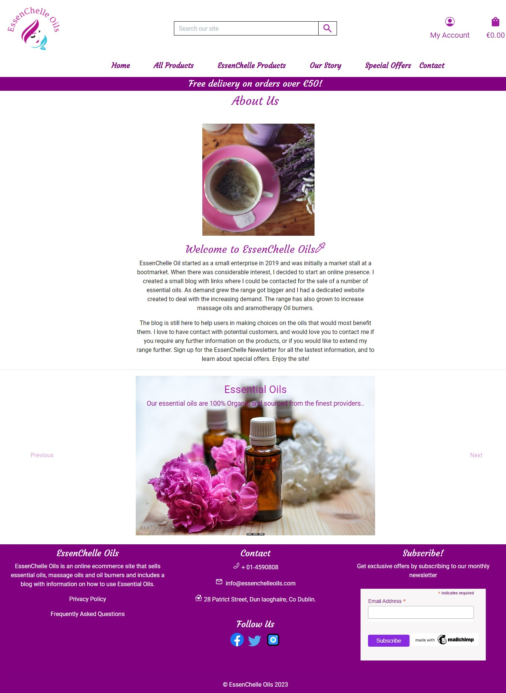

# EssenChelle Oils: Milestone 5 Project

      
          

   

 
# Introduction 

The EssenChelle Oils site is my 5th Project for the Code Institute and it is a full stack E-commerce site using the Django Framework and it includes Python, JavaScript, CSS, Bootstrap5 and it utilizes Stripe payments. It has user authentication and Full CRUD functionality for the products and Blogs. The website deals with the sale of essential oils and their byproducts. The webiste would appeal to people who use or want to know more about Essential Oils. This website has been built for educational purposes and the payment transactions are purely for demonstration only.

 

[Visit the EssenChelle Oils Site]() 

[Visit the EssenChelle Repository](https://github.com/MHickey2/EssenChelle-Oils)

  

# Table of Contents 

- [EssenChelle Oils: Milestone 5 Project](#essenchelle-oils-milestone-5-project)
- [Introduction ](#introduction-)
- [Table of Contents ](#table-of-contents-)
  - [1. UX Strategy ](#1-ux-strategy-)
    - [1. The Business Goals of the Website: ](#1-the-business-goals-of-the-website-)
    - [2. The Target Customer: ](#2-the-target-customer-)
    - [3. Site User Profile](#3-site-user-profile)
    - [4.  Site Goals](#4--site-goals)
      - [Return to Table of Contents](#return-to-table-of-contents)
  - [2. User Stories  ](#2-user-stories--)
      - [As a website User I can...](#as-a-website-user-i-can)
      - [As a logged in User I can... ](#as-a-logged-in-user-i-can-)
      - [As a website superuser, I can …..    ](#as-a-website-superuser-i-can-----)
  - [3. Agile Methodology](#3-agile-methodology)
      - [Return to Table of Contents](#return-to-table-of-contents-1)
  - [4. Design  ](#4-design--)
    - [1. Colour  Scheme  ](#1-colour--scheme--)
    - [2. Typography    ](#2-typography----)
    - [3. Imagery    ](#3-imagery----)
    - [4. Website Structure    ](#4-website-structure----)
    - [5. Wireframes    ](#5-wireframes----)
      - [Return to Table of Contents](#return-to-table-of-contents-2)
  - [Web Marketing](#web-marketing)
    - [1. E-Commerce Application Type](#1-e-commerce-application-type)
    - [2. Marketing Strategy](#2-marketing-strategy)
    - [3. Search Engine Optimization(SEO)](#3-search-engine-optimizationseo)
    - [4. XML Sitemap](#4-xml-sitemap)
      - [**Facebook Page**](#facebook-page)
  - [6. Features  ](#6-features--)
    - [1. Home Page   ](#1-home-page---)
    - [2. Products Page     ](#2-products-page-----)
    - [3. EssenChelle Products Page     ](#3-essenchelle-products-page-----)
    - [4. Product Details Page     ](#4-product-details-page-----)
    - [5. About Page     ](#5-about-page-----)
    - [6. Our Products Page     ](#6-our-products-page-----)
    - [7. Blog Page     ](#7-blog-page-----)
    - [8. Blog Details Page     ](#8-blog-details-page-----)
    - [9. Contact Page     ](#9-contact-page-----)
    - [10. Profile Page    ](#10-profile-page----)
    - [11. Product Favourites Page     ](#11-product-favourites-page-----)
    - [12. Shopping Bag Page     ](#12-shopping-bag-page-----)
    - [13. Checkout Page     ](#13-checkout-page-----)
    - [14. Checkout Success Page     ](#14-checkout-success-page-----)
    - [15. Add Product Page     ](#15-add-product-page-----)
    - [16. Edit Product Page     ](#16-edit-product-page-----)
    - [17. Delete Product Page     ](#17-delete-product-page-----)
    - [18. Add Blog Page     ](#18-add-blog-page-----)
    - [19. Edit Blog Page     ](#19-edit-blog-page-----)
    - [20. Delete Blog Page     ](#20-delete-blog-page-----)
    - [21. Signup Page   ](#21-signup-page---)
    - [22. Login Page   ](#22-login-page---)
    - [23. Logout Page   ](#23-logout-page---)
    - [24. Custom Error Pages  ](#24-custom-error-pages--)
    - [25. Admin Panel  ](#25-admin-panel--)
    - [26. Security Measures  ](#26-security-measures--)
      - [Return to Table of Contents](#return-to-table-of-contents-3)
  - [7. Future Implementation  ](#7-future-implementation--)
      - [Return to Table of Contents](#return-to-table-of-contents-4)
  - [8. Tools and Technology  ](#8-tools-and-technology--)
    - [Language Used:](#language-used)
    - [Technology Used:](#technology-used)
    - [Django Packages](#django-packages)
      - [Return to Table of Contents](#return-to-table-of-contents-5)
  - [9. Testing  ](#9-testing--)
      - [Return to Table of Contents](#return-to-table-of-contents-6)
  - [10. Bugs and Issues  ](#10-bugs-and-issues--)
    - [Resolved ](#resolved-)
    - [Unresolved ](#unresolved-)
      - [Return to Table of Contents](#return-to-table-of-contents-7)
  - [11. Deployment ](#11-deployment-)
    - [How to make a local Clone ](#how-to-make-a-local-clone-)
    - [How to fork a GitHub Repository ](#how-to-fork-a-github-repository-)
    - [Student Template ](#student-template-)
    - [Django Framework    ](#django-framework----)
    - [Deploying to Heroku ](#deploying-to-heroku-)
    - [Final Deployment](#final-deployment)
      - [Return to Table of Contents](#return-to-table-of-contents-8)
  - [Credits ](#credits-)
      - [Return to Table of Contents](#return-to-table-of-contents-9)
  - [Acknowledgements ](#acknowledgements-)
      - [Return to Table of Contents](#return-to-table-of-contents-10)

----

## 1. UX Strategy 
----

  

### 1. The Business Goals of the Website:       

- The website is an E-commerce site so a goal would be be to achieve a commercial success from sales within the site.
- Expand the customer base for the EssenChelle Oil company.
- Promote repeat customers and ensure the present customers have a good user experience.
- Use Social Media to increase awareness of the Site and strategically plan future growth of the Brand.
- Increased customer satisfaction for the site users.
- Improved retention of customers
- Effective use of discounts and value offers. 
- Create content that will engage the users and encourage them to return for more.
- Make the shopping experience easy to manage for the Shopper.
- Attract visitors and convert them into customers 
  
    

### 2. The Target Customer:     

- Anyone with an interest in essential oils and their byproducts.
    
- Anyone who wishes to buy EssenChelle Oil Products.  
- Anyone who has interest in joining the EssenCHelle Oil community and wants to learn more about our range of products. 
- anyone who wants to use essential oils in their home and are looking for essential oil burners.  
- anyone who wants to use massage techniques and wants massage oils that will be therapeutic.  

    

### 3. Site User Profile

The user is really anyone who has an interest in holistic health. They either have had some experience with essential oils or are new to Essential Oils and want to learn more about them and how to integrate them into their lives. They may want to buy products from the site or read blogs that have a focus on the benefits and the uses for the featured oils.

 

### 4.  Site Goals

- The theme of the site is easy to understand and it is easy to navigate through the site content easily.
  
- The user will be able to use the search facility to find specific products by category or word search.
- The user when logged in will be able to buy Products in the EssenChelle range.
- The user will be able to maintain a profile on the site and can update their Profile details.
- The user will be able to avail of discount and offers within the site.
- The user will be able to view blogs and can add comments for individual blogs.
- The user can see full details for individual products and if logged in they can leave reviews.
- The user can contact the site owner with queries and suggestions. 

 

 #### [Return to Table of Contents](#toc)

----

## 2. User Stories  

 

####  As a website User I can...

1. Log in and access more features on the site.   
[As a user or staff member I can log in so that I can access the relevant features of the site #1](https://github.com/MHickey2/EssenChelle-Oils/issues/1)

1. Find the purpose of the site easily by reviewing the content.
[As a User I can easily find the site's purpose so that I know whether the site fits my needs #2](https://github.com/MHickey2/EssenChelle-Oils/issues/2)

3. View a collection of Products that are available for sale.
[As a User I can view a selection of Products so that I can choose some to purchase #3](https://github.com/MHickey2/EssenChelle-Oils/issues/3)

4. Select an individual item to see the full details for the product. 
[As a Site User I can choose an individual Product so that I can see required details #4](https://github.com/MHickey2/EssenChelle-Oils/issues/4)

5. View categories aqccording to their category type.
[As a Site User I can view specific categories of Products so that I can easily find the product I am looking for #5](https://github.com/MHickey2/EssenChelle-Oils/issues/5)

6. Easily be able to identify the cheapest or most highly rated products.
[As a Site User I can sort Products so that I can quickly identify the cheapest or most highly rated products within categories #6](https://github.com/MHickey2/EssenChelle-Oils/issues/6)

7. Sort products against a number of sorting critera.
[As a Site User I can sort multiple categories so that I can view all products within a sorting function #7](https://github.com/MHickey2/EssenChelle-Oils/issues/7)

8. Informed about the progress of my actions and interactions within the site.
[The Site User will be updated with messages confirming their actions on the site #12](https://github.com/MHickey2/EssenChelle-Oils/issues/12)

9. Be able to attain and view my profile within in the site.
[As a User, when I register I will have my own Profile which will include all my information #15](https://github.com/MHickey2/EssenChelle-Oils/issues/15)

10. Receive an email when I register for the site.
[When registering a User will receive a welcome email #16](https://github.com/MHickey2/EssenChelle-Oils/issues/16)

11. Will be able to contact the site owner with the contact form.
[User can use the contact form so they can message the site owner with queries or requests #21](https://github.com/MHickey2/EssenChelle-Oils/issues/21)

12.  View a collection of Blogs in the blog Section.
[User can view a selection of blogs with information on the range of products #22](https://github.com/MHickey2/EssenChelle-Oils/issues/22)

13. User can select a blog and see the full details for that individual blog.
[User can select individual blogs and see the full details on the blog details page #24](https://github.com/MHickey2/EssenChelle-Oils/issues/24)

 

####  As a logged in User I can...  

1. Select products and these will be included in my shopping bag.
[The Shopper will be able to select various products and these will be added to their shopping Bag #8](https://github.com/MHickey2/EssenChelle-Oils/issues/8)

2. View the Total of my purchases on the site.
[The Shopper can view the total of their purchases as they shop on the site #9](https://github.com/MHickey2/EssenChelle-Oils/issues/9)

3. Select products in different sizes where available.
[The Shopper will be able to choose products in a range of sizes #10](https://github.com/MHickey2/EssenChelle-Oils/issues/10)

4. Choose to remove or adjust the items in my shopping bag.
[The Shopper will be able to adjust or remove items from their shopping bag #11](https://github.com/MHickey2/EssenChelle-Oils/issues/11)

5. Checkout the products in my shopping bag.
[The Shopper will be able to checkout the products they have added to their shopping bag #13](https://github.com/MHickey2/EssenChelle-Oils/issues/13)

6. Make a secure payment for my purchases.
[The Shopper will be taken to a secure payment screen so they can safely make their purchase #14](https://github.com/MHickey2/EssenChelle-Oils/issues/14)

7. Add a review for products on the site.
[As a registered User I can add reviews for product available on the site #20](https://github.com/MHickey2/EssenChelle-Oils/issues/20)

8. Select my favourite products on the site and save them to my product favourites.
[As a logged in user I can select my favourite products and be able to see them later #27](https://github.com/MHickey2/EssenChelle-Oils/issues/27)

9. Leave a comment for a blog in the blog section.
[Logged in user can add comments to blogs in the site #28](https://github.com/MHickey2/EssenChelle-Oils/issues/28)

10. Sign up for a newsletter so I can receive special offers and the latest product information.
[User can sign up for the newsletter and receive special offers and the latest information from the site #29](https://github.com/MHickey2/EssenChelle-Oils/issues/29)

 
  

#### As a website superuser, I can …..    

1. Add Products to the Database.
[As an Admin I can add products to the database #17](https://github.com/MHickey2/EssenChelle-Oils/issues/17)

2. Edit Products in the Database.
[The Admin will be able to edit products in the database #18](https://github.com/MHickey2/EssenChelle-Oils/issues/18)

3. Delete Products in the Database.
[The Admin will be able to delete products from the database #19](https://github.com/MHickey2/EssenChelle-Oils/issues/19)

4. Add Blogs to highlight products on the site.
[Superuser can add blogs which will highlight the Essenchelle product range available on the site #23](https://github.com/MHickey2/EssenChelle-Oils/issues/23)

5. Edit Blogs on the site.
[The Superuser can edit existing blogs on the site #25](https://github.com/MHickey2/EssenChelle-Oils/issues/25)

6. Delete Blogs on the site.
[The Superuser can delete existing blogs on the site #26](https://github.com/MHickey2/EssenChelle-Oils/issues/26)

7. Approve reviews for Products and comments for Blogs in the admin Panel

The Admin can do the full range of admin functionality within the admin panel.
User Story Testing can be found in the [TESING.md](TESTING.md)

    

## 3. Agile Methodology

The project was developed using Agile Methodology and it was by use of the GitHub Projects functionality within the GitHub Repository. The issues can be found [Here](https://github.com/MHickey2/EssenChelle-Oils/issues) and this is the link for the [Essential Oils Project Board](https://github.com/users/MHickey2/projects/2)

  

#### [Return to Table of Contents](#toc)  
----

## 4. Design   

 

### 1. Colour  Scheme  

The colour scheme was inspired by essential oils, in particular lavender oil, so the website uses this colour throughout the site. The color Lavender represents holistic wellness and it is known for its tranquility and calming effects. Lavender Oil is also one of the most popular oils and very versatile so it made sense to utilize it's popularity and use a colour most holistic users would be familiar with. There is not a lot of colour and the backgrounds are either white or lavendender where suitable. Headings, borders and the footer are purple. In this project I wanted to only have a subtle use of colour, so that there would be little distraction to the user, when making their purchases on the site.

 

      
           

      
       

  

### 2. Typography    

Google Fonts were used within the website. The 'Roboto' font is the main font used for the whole project, both for regular text and headings. Sans serif is the fallback font in case the other font is not available. See below for example of font in use on the site. The font color is #313131, which is a good font to help counter eye strain.

 

      
           

 

The main title for the site a

 

      
           

 

      
           

 

font stuff here

 

      
           

 

### 3. Imagery    

The Logo was created with [LogoMaker](https://www.logomaker.com/), as the theme was health related, I used predominantly green in the logo iteself and the logo had a strong influence on the overall website colour scheme going forward.

The imagery of the site focuses on essential oils and their byproducts, the images were sourced from the Pexels site and supplement the content. The images for the site are hosted in [Cloudinary](https://cloudinary.com/). I had used AWS for a while but was not comfortable using aws, as it was unpredictable in regards to pricing, and chose to revert to cloudinary as I trusted this platform.

There are also images sporadically placed throughout the site, There is a background image which highlights the nature of the site on the index page, the product was initially a template with no packaging, so I used it in photoshop to apply the packaging for the different products in the essential and massage oil range. The aromatherapy burners were sourced on a shopping site platorm, as it did not have to have the essenchelle branding.

There are also various icons used within the site, the icons were sourced at [Iconify.Design](https://iconify.design/) and font-awesome in some cases, and they were used as a graphical representation for pertinent information on the site, they were used in conjunction with Forms or headings and were a subtle way to incorporate imagery on a limited scale, examples can be found in the image below.

I also created the favicon for the site with [Favicon.io](https://favicon.io)

 

      
         

 

  

 

  

 

### 4. Website Structure    

The website follows the standard website structure. The Logo and the website name are on the left hand side, and the naigation to the right, on the top of all pages. Within the Account Nav Link the user can either Signup or login to the site. When the user logs in they can see the Profile link and the logout button. The logged in user's image will also be visible. When the website is on smaller screens, there is a hamburger meu, with dropdown navigation items. The footer element is also available on all pages, with site information, contact details and social media icons.

The website consists of the following Pages:
 - The Home Page, with a hero image and a button connecting to the Shop. It has a search bar and links to
  all areas in the site. There is is also a profile and shopping back link.
 - The Proucts page is available in a number of formations, it can be sorted by pricing, ratings and category and you can see all products in the EssenChelle Range.
 - The Essenchelle Products can be configured to show different categories of products. The products include Essential Oils, Massage Oils and Oil Burners, or you can view all categories at once.
 - The Product Details Page, shows the information for individual Products.
 - The Add Product Page, which is a form that allows the superuser to add a Product.
 - The Edit Product Page, which is a form that allows the superuser to edit a Product.
 - The Delete Product Page, which is a form that allows the superuser to delete a Product.
 - The Bag Page which shows the details of the products presently in the Bag.
 - The Checkout Page, which shows the details of an order and the user details form and checkout       submission button.
 - The Checkout Submission page, which shows the order details and price and Thank you message.
 - The About Page, which gives more information on the site 
 - The Our Products Page, with an introduction to EssenChelle Products by category and it includes customer testimonials.
 - The Blog Page with a spotlight on products, it highlights individual products and blogs can only be
  added by the superuser.
 - The Blog Detail Page, that shows the information for individual Blogs.
 - The Add Blog Page, which is a form that allows the superser to add a Blog.
 - The Edit Blog Page, which is a form that allows the superuser to edit a Blog.
 - The Delete Blog Page, which is a form that allows the superuser to delete a Blog.
 - The Profile Page, which contains profile information and  product history for the logged in user.
 - The User Favourites Page, which shows the users favourite products.
 - The Sign Up Page, consists of a form where a new user can register for the site.
 - The Login Page, consists of a form where the user can login to the site.
 - The logout Page, consists of a form where the user can logout of the site.
 - There are also custom error pages for errors 403,404,405 and 500.

 

### 5. Wireframes    

The Wireframes for the site were created in Figma, I concentrated on the standard websize and the mobile size. The midlevel sizes were generally in keeping with the main websize but just on a smaller scale. The Wireframes can be found below:

Figma Wireframes

  
1. Home Page Wireframes

   
  

         

  
2. Products Page Wireframe

   

  

  
3. EssenChelle Product Page Wireframe

   

  

  
4. Product Details Page Wireframe

   

  

  
5. AboutPage

   

  

  
6. Our Products Page

   

  

  
7. Blog Page

   

  

  
8. Blog Details Page

   

  

  
9. Contact Page

   

  

  
10. My Profile Page

   

  

  
11. Favourites Page

   

  

  
12. Shopping Bag Page

   

  

  
13. Checkout Page

   

  

  
14. Checkout Success Page

   

  

  
15. Add Products Page

   

  

  
16. Edit Product Page

   

  

  
17. Delete Products Page

   

  

  
18. Add Blog Page

   

  

  
19. Edit a Blog Page

   

  

  
20. Delete a Blog Page

   

  

  
21. Registration Page

   

  

  
22. Log In Page

   

  

  
23. Logout Page

   

  

 

 #### [Return to Table of Contents](#toc)
----

 

## Web Marketing

### 1. E-Commerce Application Type
EssenChelle Oil is a B2C E-Commerce Application. It deal with seling directly to its customer. There is a great emphasis in promoting a good user experience for the customer. The aim is to retain current customers and at the same time grow the customer base by organic means. 

### 2. Marketing Strategy
Essenchelle Oils is a fledgling company, with a limited budget for marketing, so decisions need to be cost effective and practical. That being said the company has come up with a range of marketing strategies, ie content marketing, utilizing social media platforms, digital promotions, and highlighting events that will promote the products firsthand. The goal is is to increase project sales, create a following online and concentrate on building brand awareness.

Social Media will play a big part in the marketing strategy, research into the different platforms has highligted ways that can be cost effective and easy to implement. Facebook is a great way to fuild up followers and share information with a wide range of customers. A Facebook page was created to share pertinent information with the users, and promotes the latest great deal, that should entice new customers to the EssenChelle site. The image below shows the Facebook page [EssenChelle Oils]().

Google Ads : This option is out of reach at the moment, as the budget is small, but with enough experience and analysis I hope to be able to plan a campaign in the future that will be cost effective and will earn results.

There is a large industry dealing with essesntial oils and aromatherapy in Irelan, and indeed worldwide. In this regard you can tap into existing events that are used to promote the industry and that are very accessible to the public. One of the largest event, occurs yearly in the RDS in the Body Mind Spirit fair where a range of companies, mostly smaller companies have the opportunity to highlight their products to a very involved and motivated audience. You have the opporuity to mingle with and sell directly to the public and grow a valuable network which will pay dividents for future business. This would play a major
part in growing the brand and linking with a potentially large customer base. But this occurs later in the year, and meantime smaller events, in this vein are held in venues throughtout the country and would be an excellent way to connect with the right clientele. As well as growing a customer base it wold be good to network with other business's and there may be some mutual gains in forging such alliances.

The website itself offers users the chance to sign up for a regular newsletter. This newsletter would be a good way to promote new products, provide articles which highlight the benefits of using certain products, offer special offers and highlight new arrival products. This will be a great way to grow the Essenchelle community and keep the customers in the loop. The newsletter functionality utilizes mailchimp, who will keep track of users and with their extensive capabilities, the company would seek to utilize more of their services in the future.

###  3. Search Engine Optimization(SEO)
SEO research will help drive pople to our site more efficiently. Inititally finding the right keywords will help send our site further up in the rankings. Finding the right words involved looking at present sites, previous research finding and analysing which words were suggested when searching for essential oils and aromatherapy in particular. I then picked the top words ad phrased and ensured they were integrated into the site via meta-tags or by ensuring they were included in headings, image names and content. There were also links included for bother internal pages and external sites of good standing that are in a similar industry.

### 4. XML Sitemap
Additionally to help the search engines crawl the site, I've added an XML sitemap file to the main root directory. 

A robots.txt file has also added to indicate to the search engine crawlers which URLs the crawler can access on this ste, used mainly to avoid overloading the site with requests.

#### **Facebook Page**

---

## 6. Features  

There are features common to all pages in the site and these are found in the base.html page. These include:

- The Logo and Site Title:
  
The logo was the first asset I created in Logo maker it depicts a simple female image with the main colours displayed in the site. The Logo includes the name of the site, so the logo is synonomous with the brand. Using the name in the logo meant I had a readymade image for the packaging of the products in the range. The image relates to the area of health and Beauty, as essential oils are strongly related to the promotion of health and beauty benefits. 

 

      
         

  

There is a searchbar, where the user can put in their search criteria term. There is an Account Icon, which contains a dropdown menu:

Account Icon - Register, Log In (Before Log in or registering)
Account Icon - Product Management, My Profile, Product Favourites, Log Out. (If logged in)

Shopping Bag Icon - Takes you to the Shopping Bag Page.

- The Navigation Bar:

The navigation consists of the following options: All Products, EssenChelle Products, Our Story, Special Offers and Contact. Each of these Nav items have dropdown menus:

All Products - By Price, By Rating, By Category and All Products.
EssenChelle Products - Essential Oils, Massage Oils, Oil Burners and All Products.
Our Story - About Us, Our Products and Blog.
Special Offers - New Arrivals, Deals, Clearance and All Specials.
Contact - Contact Form.
   

      
         

  

On smaller screens, there is a hamburger menu where the navigation items appear in a collapsable dropdown menu. The image is included in this menu.

 

      
         

  

- The Footer:
The Footer contains a blurb on the site, some contact details and social media icons, also the copyright information on the EssenChelle Oils site. THe footer also includes a newsletter sign up form provided by mailchimp.

  

      
         

 

### 1. Home Page   

The home page has an introductory image and a shop button, that can bring you directly to the product page.
  
 

      
         

  

### 2. Products Page     

The products page shows the the full collection within the EssenChelle range including the special offers. These products can be arranged according to specified criteria, such as by price, by rating and by category. 

 

      
         

  

### 3. EssenChelle Products Page     

 
This Page shows products in the category of Essential, Massage and Burners. You can select to see products within just one category by choosing the option in the dropdown menu or by selecting the relevant button at the top of the page. You can view the number of products and there is a facility for sorting at the top of the page. The options include price, rating, name and category.

 

      
         

 

### 4. Product Details Page     
The Page shows the full details of an individual product including an image. There is a review form, where a product user can leave a review for others, there is also a review section showing existing reviews.

 

      
         

 

### 5. About Page     

The About Page provides information on EssenChelle Oil, gives information of background and what services the company offers. It also features a carousel with information on the different categories on offer in the site.

 

      
         

  

### 6. Our Products Page     

The our products page shows information of each category in the product range. It also provides customer
testimonials on why to choose a product in the EssenChelle Product Range.

 

      
         

  

### 7. Blog Page     

The Blog Page shows a collection of blogs with a spotlight on products being sold on the site. The sidebar gives a brief introduction to the blogs. There is a link with more comprehensive information on individual essential oils. It also shows the titles for the 5 latest blogs available.

 

      
         

 

### 8. Blog Details Page     
The Blog Detail page shows the full blog which has information pertaining to products on the site. It will either concentrate on an indivual oil, or a selection of products, it may also include internal links to products within the site. There is also a comment form, for logged in users to leave a comment and there is a comment section for existing comments.

 

      
         

 

### 9. Contact Page     
The contact page has a map showing the location of the Company, contact information and a contact form so that the user can send a message to the company.

 

      
         

 

### 10. Profile Page    
The Profile page contains a form to update your default delivery information and order history.
 

      
         

 

### 11. Product Favourites Page     
The Page shows a collection of the user's product favourites

 

      
         

 

### 12. Shopping Bag Page     
The Page shows the products that the user has currently in their shopping bag.
 

      
         

 

### 13. Checkout Page     
The Checkout Page shows the form to complete the order and the order summary. You can adjust your bag or you can complete your order.
 

      
         

 

### 14. Checkout Success Page     
The Page is shown to the user when their order has been processed. It contains a Thank you message and includes the order information, and a link to the new arrival products on the site.

 

      
         

 

The following pages are also available, but only to the superuser on the site.

### 15. Add Product Page     
This Page is also the product management page. The superuser can add a product in the frontend as well as in admin. It can be accessed via the account icon or with a button at the bottom of the products page.

 

      
         

 

### 16. Edit Product Page     
The Page has a form which allows the superuser to edit product details for individual products.

 

      
         

 

### 17. Delete Product Page     
The Page has a form which allows the superuser to delete products.
 

      
         

 

### 18. Add Blog Page     
The Page has a form which allows the superuser to add a blog to the blog collection. The button is available on the bottom of the blog page.

 

      
         

 

### 19. Edit Blog Page     
The Page has a form which allows the superuser to edit an existing blog. The link is available under the blog excerpt in individual blogs in the blog page.

 

      
         

 

### 20. Delete Blog Page     
The Page has a form which allows the superuser to delete an existing blog. The link is available under the blog excerpt in individual blogs in the blog page.

 

      
         

 
 

###  21. Signup Page   

On the Signup Page, a new user can sign up for the Wannabe Healthy website by filling out and submitting the form. On registering they will be assigned a Profile for the site.

 

      
         

 

###  22. Login Page   

A registered User can log in to the website by inputting their username and password and they will have full access to all the features within the site. 

 

      
         

  

###  23. Logout Page   

In the Logout Page, the User can confirm that they want to exit the website.

 

      
         

  

### 24. Custom Error Pages  

I have included custom Error Pages in the error folder within the templates folder(403,404,405,500), Below is the image from the 404 page, but they all look similar, barring the fault lines.

 

      
         

  

### 25. Admin Panel  

The admin panel allows the admin/superuser to perform a wide range of functionalities within the site. The admin can add, delete, edit product, blog, users. The admin can also approve reviews for individual products and comments for individual blogs.

 

      
         

 

      
         

  

### 26. Security Measures  

To ensure security on the site, only logged in users can access certain features on the site. A logged in user can add a product review or comment for a blog in the blog section. A superuser can add, updata and delete products within the admin panel. The superuser also has access to add, edit and delete products within the product pages. The superuser can add, edit and delete blogs in the admin panel but they can also access these capabilities within the blog page. Only the Admin/Superuser can access the admin Panel(would need sign in credentials).The Database URL and secret key are stored in the env.py file to prevent unwanted connections to the Database. As I was following the boutique ado walkthrough, I had not realised the secret key was commited in the early stages of the development, after doing my research into the issue and with the advice from CI, I generated a new key, and this was immediately put in the env.py file, making the other key obselete. All secret keys were included in the env.py file. Cross-Site Request Forgery (CSRF) Tokens are used on all Forms within the App for added protection. All keys needed for the inclusion of AWS, CLoudinary and Stripe were concealed for security purposes.

 

      
         

  

 #### [Return to Table of Contents](#toc)
----

 ## 7. Future Implementation  

  

 This is my first E-Commerce Site, so the main goal is to have a fully functional site with customised models to expand on the original concept as defined in the Boutique Ado Walkthrough. There were a number of features that I would like to expand upon in the future.

 In relation to the products, I would like to expand the information relating to the product. Besides the description, I would ike to include directions for use and cautions. You could also sort products according to the health conditions that can be addressed by using them i.e. insomnia, anxiety, respiratory issues.

 In regards to the blogs I have just added a few basic blogs, with heavy emphasis on product spotlighting for marketing purposes. These blogs could also be broken down into further categories, outside fo this remit. You can add a do it yourself section, where you could provide simple instructions for users to use the products in creative ways, this is incorporated into the present blog in a small way, but would be a great way for users to learn to integrate the products into their lives. I would also include a recipe category where you could provide the user with recipes using the essential oils. This could be a good way to get users to interact with the site. you could ask the users to contribute their own recipes via the social media channels or by contacting the company directly with the contact form. User's recipes could then be featured on the site. Healthy Living could also be a category and you could give advice on how to use oils in the home and provide tips for everyday living in relation to EssenChelle Oils. These measures should not only drive sales, but should create a a thriving community with a shared interest in essential oil and their byproducts.

 In regard to the profiles, I would customise it more for the user, in the previous project I had an image for the profile user, but would rather ensure I meet all the project criteria first, and if there is time at the end I could explore this possibility, but if not will introduce this in a future iteration.

 In regard to the review, I had looked into the idea of using the ratings in the reviews in the product rating, again this is still a possibility, but time restraints this may not be possible at this time.

 
  

#### [Return to Table of Contents](#toc)
----

 ## 8. Tools and Technology  

### Language Used:

-   [Python 3.8.10](https://www.python.org/)
-   [HTML5](https://en.wikipedia.org/wiki/HTML5)    
-   [CSS3](https://en.wikipedia.org/wiki/CSS)
-   [JavaScript](https://www.javascript.com/)
-   [Django](https://www.python.org/)

### Technology Used:

-   [Am I Responsive](http://ami.responsivedesign.is/) - was used to create the multi-device mock-up above.
-   [Bootstrap v5.2.3](https://getbootstrap.com/)
-   [Git:](https://git-scm.com/) - used for version control, updated and commited changes (this in turn updated site in Heroku). 
-   [GitHub:](https://github.com/) - is the respository for all the git pushes.
-   [Gitpod](https://gitpod.io/) - was the IDE Editor.
-   [Heroku:](https://heroku.com) - used to deploy the application.
-   [Google Chrome Dev Tools](https://developer.chrome.com/docs/devtools/) - Used for Testing Site.
-   [Markdown](https://markdown-guide.readthedocs.io/en/latest/) - Markdown Guide.
-   [Cloudinary](https://cloudinary.com/) - used for images for the site.
-   [Elephant SQL](https://www.elephantsql.com/) – deployed project on Heroku uses an Elephant SQL database. 
-   [Draw.io](https://drawio-app.com/) - used for the database diagram.
-   [Iconify.Design](https://iconify.design/) - Icons used for the site.
-   [LogoMaker](https://www.logomaker.com/) - For creating the Logo for the site.
-   [Favicon.io](https://favicon.io) - for making the site favicon.
-   [tinyPNG](https://tinyjpg.com/) - for image compression.
-   [Figma](https://www.figma.com/) - used for making the wireframes for the site.
-   [Code Institute Python Linter](https://pep8ci.herokuapp.com/) - used to validate Python in Project.
-   [Accesibility Test](https://accessibilitytest.org/) - free accessibility testing tool.
-   [Dr Link Checker](https://www.drlinkcheck.com/) - used in conjunction with manual testing of links.

### Django Packages

* [Gunicorn](https://gunicorn.org/) - As a server for Heroku.
* [Cloudinary](https://cloudinary.com/) - Was used to host the static files and media.
* [Dj_database_url](https://pypi.org/project/dj-database-url/) - To parse the database URL from the environment variables in Heroku.
* [Psycopg2](https://pypi.org/project/psycopg2/) - As an adaptor for Python and PostgreSQL databases.
* [Summernote](https://summernote.org/) - As a text editor for adding content to the site.
* [Allauth](https://django-allauth.readthedocs.io/en/latest/installation.html) - For authentication, registration, account management.
* [Crispy Forms](https://django-crispy-forms.readthedocs.io/en/latest/) - To style the forms used in the site.
 
  

#### [Return to Table of Contents](#toc)
----

## 9. Testing  

 

Go to the [TESTING DOCUMENT](TESTING.md)

#### [Return to Table of Contents](#toc)
----

 ## 10. Bugs and Issues  

 There have been a number of issues during development. Initially there was major issues with images, both sourcing assets and resizing them so they are uniform on the site. I wanted the products to carry the brand of the site, so this meant they had to be customised within photoshop. The special offer section are different in that they have a coloured background, but the sizing is the same, so I could live with that.

 

 ### Resolved 

  

 ### Unresolved 

  

 #### [Return to Table of Contents](#toc)
----

 ## 11. Deployment 

 The Project used Heroku for deployment. I used GitPod for development within the project and pushed to the GitHub Repository. This in turn updated the Project in Heroku. I used DEBUG = 'DEV' in os.environ, during development and other than when testing, had it configured so that I could work both locally and could also test the deployed Project on an ongoing basis.

  

Github

 ### How to make a local Clone 
1. Navigate to the main page of the repository.
2. Click the green Code Button at top right of the repository.
3. Copy the url for the repository.
4. Open Git Bash and Change the current working directory to where you want the cloned directory.
5. Type git clone, and then paste the URL you previously copied using $ git clone. 
6. Pressing enter will then create your clone.  

   

### How to fork a GitHub Repository 
1. Log into GitHub and go to the required Repository.
2. The Fork button is found at the top right corner of the page.
3. When you click this button you will have a copy of the repository in your own GitHub account.  

  

More information is available at [https://docs.github.com/en](https://docs.github.com/en), in regards to GitHub and is a great reference point for all GitHub queries.

 

Code Institute

 ### Student Template 
 This Template has been provided by the Code Institute and includes a number of tools to make life easier and has been used within this present site.    

 

### Django Framework    

I used the Resources and Lessons within the Full Stack Frameworks Module to get familiar with the concepts involved in creating the present Project. In particular I did the walkthroughs for 'Hello Django' and 'I Think Therefore I Blog', and I used the cheatsheet, [Django Blog Cheat Sheet](https://docs.google.com/document/d/1P5CWvS5cYalkQOLeQiijpSViDPogtKM7ZGyqK-yehhQ/edit), which helped me set up the basic Django Project. I also looked at the 'Boutique Ado' walkthrough, as when I was creating the profile app, I wanted to see how it was handled within this project, It also helped me solidify some concepts that I had not grasped in the previous walkthrough.

 

Heroku

 

### Deploying to Heroku 
- After registering on the Heroku site, you can see the dashboard. You can select 'New' and then click 'Create new app'. You need to pick a unique name for your app, it will let you know if it is  to available to use.
- Select your region and create your app.
- Go to the settings tab and scroll until you find the config vars section and pick 'Reveal config vars',
in this case I added 'PORT' into the key field and added '8000' into the value field and click 'add'.
- If you have credentials, you must create another config vars called 'CREDS' and you would paste the JSON into the value field.
- You have to to the builldpacks section and click 'add buildpack'.
- In this case I added 'Python' and saved changes.
- Next you go to the Deploy tab and you select 'github' and confirm connection to your GitHub Account.
- You search for your project repository and click to 'connect'.
- Under the deploy options, you can chose automatic deploys, this allow you to automatically deploy each
time you push to your Repository. (Option Taken)
- To deploy, you would choose what branch you want to deploy and click on 'Deploy Branch'.
- It takes a little time to build your app but when it is ready you can open your app by using the link provided.

 

### Final Deployment 

- When development is complete change the debug setting to: `DEBUG = False` in settings.py
-  In this project the summernote editor was used so for this to work in Heroku, so you need to add: `X_FRAME_OPTIONS = SAMEORIGIN ` to Settings.py.
- In Heroku settings, delete the config vars for `DISABLE_COLLECTSTATIC = 1` (I had disabled these earlier in the project development)
- You can manually deploy your branch in the deploy section in Heroku, but I had automatic deployment chosen so the Site was updated everytime I pushed to GitHub.

 

#### [Return to Table of Contents](#toc)
----

 ## Credits 

 All images on the site were sourced in Pexels, the initial template for the essential oil and massage oil bottles were sourced in freepics. These templates were used in photoshop in combination with a brand created with [LogoMaker](https://www.logomaker.com/) to create customised images with the essenchelle brand, to add authenticity to the website. The Doterra essential oil images were found on the Pexel's site, but they were referenced in the product description.

 The logo and Favicon were built with the online tools: [LogoMaker](https://www.logomaker.com/) and 
 [Favicon.io](https://favicon.io/)

 he Project began with the basic code used in the 'Boutique Ado' walkthrough Project, but was modified according to my own needs within the Project. As the Project developed, I sought out various Tutorials and consulted documentation for Django.

 I also used the following online resources:

- [Code Institute](https://codeinstitute.net/ie/)
- [Slack](https://slack.com/intl/en-ie/) 
- [Stack OverFlow](https://stackoverflow.com)
- [YouTube](https://www.youtube.com/)
- [Card Zoom Hover Effect video on YouTube](https://www.youtube.com/watch?v=KAHjf1Xj0SU)
- [W3Schools.com](https://www.w3schools.com/)
- [Ordinary Coders: Bootstrap Card Hover Effects](https://ordinarycoders.com/blog/article/codepen-bootstrap-card-hovers)

 

#### [Return to Table of Contents](#toc)
----
 ## Acknowledgements 

 

 

 #### [Return to Table of Contents](#toc) 
----