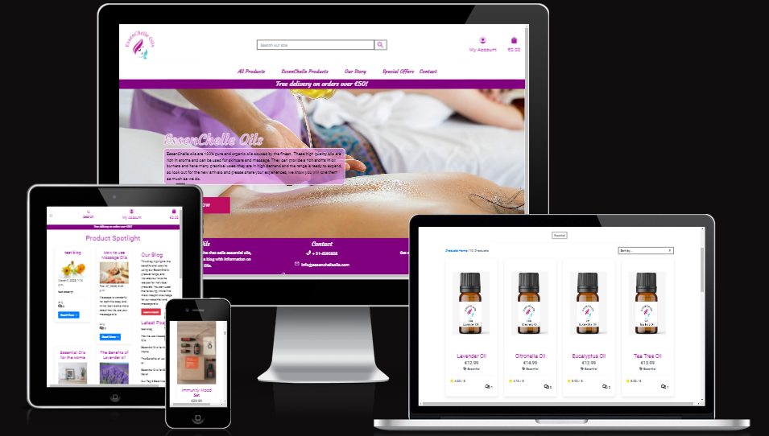
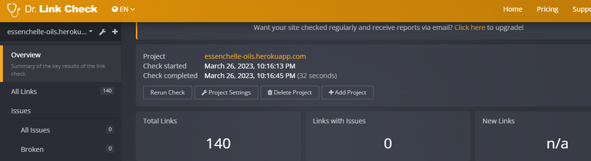

# EssenChelle Oil: Testing

Back to the [README](README.md)

Testing has taken place continuously throughout the development of the project. When faults were detected they were fixed on an ongoing basis. These were fixed locally in GitPod and committed to GitHub regularly. Faults fixed and outstanding can be found in the README.md Document.

# Table of Contents 

1. [Cross Browser Testing](#browsertesting)
2. [Responsive Testing](#responsivetesting)
3. [Validator Testing](#validatortesting)
     1. [W3C Validator](#w3c)
     2. [CSS Validator](#css)
     3. [Python](#python)
     4. [Lighthouse](#lighthouse)
     5. [Accessabilty](#accessability)
     6. [Contrast Checker](#contrastchecker)
     7. [WAVE](#wave)
     8. [Link Checker](#linkchecker)
4. [Manual Testing](#manual)
5. [User Story Testing](#userstorytesting)  

#### [Return to README.md](README.md)
----

## Cross Browser Testing

  The site was tested in Google Chrome, Microsoft Edge and Mozilla Firefox on the Desktop. The site was tested on a Lenovo Laptop, and a Xiomai Redmie Note 11. 

 

#### [Return to Table of Contents](#toc)

----
## Responsive Testing

   I regularly tested the responsiveness of the site using Google Chrome Developer tools, information on this can be found [here](https://developer.chrome.com/docs/devtools/). I also used Window Resizer and a Responsive Design Tester Application available in the Google Chrome Store. I also used the Am I responsive site to test the site and the image below is from that Testing:

    

   
      
         
   

     

#### [Return to Table of Contents](#toc)

----
## Validator Testing

1. W3C Validator 

Using [https://validator.w3.org/](https://validator.w3.org/) All Pages were tested with the validator, the results of the HTML validation can be seen below:

 

      
        

   
  
2. Jigsaw CSS Validator   
 
Using [https://jigsaw.w3.org/css-validator/](https://jigsaw.w3.org/css-validator/) 
The result can be seen below:

 

      
        

 

3. Python Validation   
  Python testing was done without the use of Pep8 as the site was down, instead an extension was added which highlighted errors and showed them in the problems panel within gitpod. Most errors during the build related to long lines, which I rectified. I also used [Code Institute Python Linter](https://pep8ci.herokuapp.com/)

   

  
      
        
  

  
   

4. Lighthouse Testing   

      
         

  

5. Accessability Testing   
Used this tool, [Accesibility Test](https://accessibilitytest.org/) which carries out a range of tests on the site and the score can be seen below:

      
         

  

6. Contrast Checker  
  
  Using [https://color.a11y.com/](https://color.a11y.com/)   See images Below.

 
  
      
        
  

  
   

7. Wave (Web Accesability Evaluation tool)   
  
 

  
      
        
  

  
   

8. Link Checker   
Besides manually checking links on the site I used this tool as an extra measure for testing and the result can be seen below:

 

  
      
        
  

  
   

 #### [Return to Table of Contents](#toc)
----  

### 4. Manual Testing   

I have broken the manual testing into 2 sections, the first gives an overview of how the site works and whether it does what is expected. In the second section I have more specific testing of different elements within each page and the subsequent results.

<h3 align ="center">      
    Manual Testing (Overview of how the Site works in general)   
</h3>

### On the Site:
- Start Screen displays when Heroku link is used.   :heavy_check_mark:
- The searchbar shows the results in products when search criteria is entered and selected.  :heavy_check_mark:
- The Account Link displays correctly for a user that is not logged in, it show Register and Login.  :heavy_check_mark:
- The Register link opens up the sign up form and allows a User to register for the site.  :heavy_check_mark:
- The Login Link opens up the login form and allows the User to login into the site.  :heavy_check_mark:
- The Account Icon displays a new set of options in the dropdown menu when the user is logged in and it is selected. :heavy_check_mark:
- The Product Management dropdown item takes you to the add product page.  :heavy_check_mark:
- The My Profile dropdown item takes you to the profile page.   :heavy_check_mark:
- The Product Favourites dropdown item takes you to the product favourites page.  :heavy_check_mark:
- The Logout link displays when the user has logged in.  :heavy_check_mark:
- The Logout dropdown item takes you to the Log out page.  :heavy_check_mark:
- The Logout link opens up the logout form and allows the User to logout of the site.  :heavy_check_mark:
- The Shopping Icon takes you to the Shopping Bag Page.  :heavy_check_mark:
- The all products link in the navbar shows the dropdown menu with the different options available  :heavy_check_mark:
- The by price options shows all products in order of price.  :heavy_check_mark:
- The by price options shows all products in order of rating.  :heavy_check_mark:
- The by price options shows all products in order of category.  :heavy_check_mark:
- The all products options shows all products.  :heavy_check_mark:
- The EssenChelle Products link in the navbar shows the dropdown menu with the different options available.
- The Essential Oils option shows all products in the Essential range.  :heavy_check_mark:
- The Massage Oils option shows all products in the Massage range.  :heavy_check_mark:
- The Oil Burner option shows all products in the Oil Burner range.  :heavy_check_mark:
- The all products options shows all products in the EssenChelle range.  :heavy_check_mark:  
- The Our Story link in the navbar shows the dropdown menu with the different options available.  :heavy_check_mark:
- The About us option takes you to the about us page.  :heavy_check_mark:
- The Our Products option takes you to the our products page.  :heavy_check_mark:
- The Blog option takes you to the blog page.  :heavy_check_mark:
- The Special Offers link in the navbar shows the dropdown menu with the different options available.
- The New Arrivals option shows the new arrival products.  :heavy_check_mark:
- The Deals option shows the new deals in products.  :heavy_check_mark:
- The Clearance option shows all the clearance products.  :heavy_check_mark:
- The all products options shows all products in Special Offers.  :heavy_check_mark: 
- The Contact link in the navbar shows the dropdown menu with the contact form option available.  :heavy_check_mark:
- The contact form opens up the contact page with the contact form for messaging.  :heavy_check_mark:
- The Shop Button opens up the all products page successfully.  :heavy_check_mark:
- The Facebook Icon when clicked takes you to a generic facebook page.  :heavy_check_mark:
- The Twitter Icon when clicked takes you to a generic twitter page.  :heavy_check_mark:
- The Instagram Icon when clicked takes you to a generic Instagram page.  :heavy_check_mark:
- The Newsletter Mailchimp Form takes an email input and submits email to Mailchimp. :heavy_check_mark:

  
Manual Testing(part 2)

 

### Navigation Links on Base Page (on all pages)

 

| Feature            |  Expect                       | Action   | Result    |
| ------------------ | ----------------------------- | -------- | ----------|
|  Logo              | Navigation Link               | Click On |   ✔       | 
|  Home              | Navigation Link               | Click On |   ✔       |
|  Search Bar        | Navigation Link               | Click On |   ✔       |
|  If Results        | Results are Displayed         | Click On |   ✔       |
|  If no Results     | Message Shown to Advise       | Click On |   ✔       |
|  My Account Icon   | Dropdown Menu                 | Click On |   ✔       |
|  Register          | Navigation Link               | Click On |   ✔       |
|  Log In            | Navigation Link               | Click On |   ✔       |
|  My Profile        | Navigation Link               | Click On |   ✔       |
|  Product Favourites| Navigation Link               | Click On |   ✔       |
|  Log out           | Navigation Link               | Click On |   ✔       |
|  Shopping Bag Icon | Navigation Link               | Click On |   ✔       |
|  Home              | Navigation Link               | Click On |   ✔       |
|  All Products      | Dropdown Menu Link            | Click On |   ✔       |
|  By Price          | Navigation Link               | Click On |   ✔       |
|  By Rating         | Navigation Link               | Click On |   ✔       |
|  By Category       | Navigation Link               | Click On |   ✔       |
|  All Products      | Navigation Link               | Click On |   ✔       |
|Essenchelle Products| Dropdown Menu Link            | Click On |   ✔       |
|  Essential Oils    | Navigation Link               | Click On |   ✔       |
|  Massage Oils      | Navigation Link               | Click On |   ✔       |
|  Oil Burners       | Navigation Link               | Click On |   ✔       |
|  All Products      | Navigation Link               | Click On |   ✔       |
|  Our Story         | Dropdown Menu Link            | Click On |   ✔       |
|  About Us          | Navigation Link               | Click On |   ✔       |
|  Our Products      | Navigation Link               | Click On |   ✔       |
|  Blog              | Navigation Link               | Click On |   ✔       |
|  Special Offers    | Dropdown Menu Link            | Click On |   ✔       |
|  New Arrivals      | Navigation Link               | Click On |   ✔       |
|  Deals             | Navigation Link               | Click On |   ✔       |
|  Clearance         | Navigation Link               | Click On |   ✔       |
|  All Specials      | Navigation Link               | Click On |   ✔       |
|  Contact           | Dropdown Menu Link            | Click On |   ✔       |
|  Contact Form      | Navigation Link               | Click On |   ✔       |

 

### Footer  (on all Pages)

| Feature               |  Expect                                   | Action   | Result    |
| ------------------    | ----------------------------------------- | -------- | ----------|
| Icon Facebook         | Social Media Link - goes to external site | Click On |   ✔       |
| Icon Twitter          | Social Media Link - goes to external site | Click On |   ✔       | 
| Icon Instagram        | Social Media Link - goes to externalsite  | Click On |   ✔       |
| Newsletter Submission | Newsletter Form - Email address input and | Input    |   ✔       |
|                       | submission button works - Email Saved     | Click On |   ✔       |

 

### Home Page

| Feature             |  Expect                                   | Action   | Result  |
| ------------------  | ----------------------------------------- | -------- | --------|
| Shop Now Button     | Button takes the user to the Products Page| Click On |  ✔      |

 

### Products Page
products page can be displayed in a number of different formats, tested the page according to the different display criteria:

| Feature                |  Expect                                   | Action   | Result    |
| ------------------     | ----------------------------------------- | -------- | ----------|
| Sorting by price       | Products are arranged by price            | Click On |    ✔      | 
| Sorting by rating      | Products are arranged by rating           | Click On |    ✔      |
| Sorting by category    | Products are arranged by category         | Click On |    ✔      |
| sorting feature on page| Sorts correctly by criteria selected      | Click On |    ✔      |
| Zoom Effect on Products| Zoom Effect                               | Hover    |    ✔      |
| Product image link     | Opens the product detail Page             | Click On |    ✔      |
| Add a Product Button   | Opens the add a Product Page              | Click On |    ✔      |
| Edit a Product Link    | Opens the edit a Product Page             | Click On |    ✔      |
| Delete a Product Link  | Opens the delete a Product Page           | Click On |    ✔      | 
| Product amount         | Shows correct number for Product ammount  | Click On |    ✔      |

All products were displayed the same way, regardless of the category type so the EssenChelle Products and Special Offers sections displayed the products, the same way as the main products page, so all the individual elements are working properly.

 

### Product Detail Page

| Feature                 |  Expect                         | Action       | Result    |
| --------------------    | --------------------------      | --------     | ----------|
| Product is featured     | Displays Correctly              | Automatic    |    ✔      |
| Add to Favourites       | Adds Product to User favourites | Click On     |    ✔      |
| Quantity Selector       | Can add or delete quantitiy     | Click On     |    ✔      |
| Add to Bag Button       | Adds Product to Shopping Bag    | Click On     |    ✔      |
| Pop Up                  | Displays information of Purchase| Click On     |    ✔      |
| Keep Shopping Button    | Allows user to Keep Shoppig     | Click On     |    ✔      |
| Edit Button shows       | Displays if User is superuser   | Automatic    |    ✔      |
| Edit Button             | Opens the Edit_Product Page     | Click On     |    ✔      |
| Delete Button shows     | Displays if User is superuser   | Automatic    |    ✔      |
| Delete Button           | Opens the Delete_Product Page   | Click On     |    ✔      |
| Review & No             | Show number of Reviews          | Automatic    |    ✔      |
| Reviews are displayed   | Displays Correctly              | Automatic    |    ✔      |
| Review Form shown       | Displays Correctly              | If logged in |    ✔      |
| Submit Review Button    | Submits a review                | If logged in |    ✔      |
| Back Button             | Go to Home Page                 | Click On     |    ✔      |     

 

### Add A Product Form Page (Product Management Page)

| Feature             |  Expect                     | Action    | Result|
| --------------------| --------------------------  | --------  | ------|
| Category Field      | Shows Categories            | Click On  |   ✔   |
| Input Fields        | Accepts input               | Input     |   ✔   |
| Image Upload        | Uploads Image               | Click On  |   ✔   |
| Add Product Button  | Adds Product                | Click On  |   ✔   |
| Back Button         | Go to Home Page             | Click On  |   ✔   | 

 

### Edit A Product Form Page

| Feature              |  Expect                     | Action    | Result|
| -------------------- | --------------------------  | --------  | ------| 
| Category Field       | Shows Category              | Automatic |   ✔   |
| Text Fields          | Shows Details of Product    | Input     |   ✔   |
| Image Displays       | If image already uploaded   | Automatic |   ✔   |
| Image Upload         | Uploads Image               | Click On  |   ✔   |
| Update Product Button| Edits Product               | Click On  |   ✔   |
| Back Button          | Go to Home Page             | Click On  |   ✔   | 

 

### Delete a Product Form Page

| Feature             |  Expect              | Action    | Result|
| --------------------| -------------------- | --------  | ------| 
| Product Name        | Displayed to User    | Automatic |   ✔   |
| Delete Button       | Deletes the Blog     | Click On  |   ✔   |
| Back Button         | Go to Home Page      | Click On  |   ✔   | 

 

### About us Page

| Feature                     |  Expect                      | Action      | Result  |
| --------------------        | --------------------------   | --------    | ------  | 
| Products Carousel indicators| Carousel changes images      | Click On    |   ✔     |
| Back Button                 | Go to Home Page              | Click On    |   ✔     | 

 

### Our Products Page

| Feature                     |  Expect                      | Action      | Result  |
| --------------------        | --------------------------   | --------    | ------  | 
| Zoom Effect      | Zoom effect on Products & Testimonials  | Click On    |   ✔     |
| Back Button      | Go to Home Page                         | Click On    |   ✔     | 

 

### Blog Page

| Feature             |  Expect                            | Action       | Result |
| --------------------| --------------------------         | --------     | ------ |
| Blogs               | Displays Correctly                 | Automatic    |    ✔   |            
| Add a Post Button   | Opens add Post Form if superuser   | Click On     |    ✔   |     
| Edit Post Button    | Opens Edit Post Form if superuser  | Click On     |    ✔   |
| Delete Post Button  | Opens Delete Post Form if superuser| Click On     |    ✔   |
| Comment & No        | Show number of Comments            | Automatic    |    ✔   |
| Top Button          | Go to Top of Screen                | Click On     |    ✔   |
| Zoom Effect on Blogs| Zoom Effect                        | Hover        |    ✔   |
| Read More Button    | Go to Post_Detail Page             | Click On     |    ✔   |
| Learn More Button   | Takes user to Site with more info  | Click On     |    ✔   |

 

### Blog Details Page

| Feature                 |  Expect                    | Action       | Result    |
| --------------------    | -------------------------- | --------     | ----------|
| Blog is featured        | Displays Correctly         | Automatic    |    ✔      |
| Comment & No            | Show number of Comments    | Automatic    |    ✔      |
| Comments are displayed  | Displays Correctly         | Automatic    |    ✔      |
| Comment Form shown      | Displays Correctly         | If logged in |    ✔      |
| Submit Comment Button   | Submit a comment           | If logged in |    ✔      |
| Back Button             | Go to Home Page            | Click On     |    ✔      |     

 

### Add A Blog Form Page

| Feature             |  Expect                     | Action    | Result|
| --------------------| --------------------------  | --------  | ------|
| Input Fields        | Accepts input               | Input     |   ✔   |
| Image Upload        | Uploads Image               | Click On  |   ✔   |
| Status Field        | Shows Options               | Click On  |   ✔   |
| Add Blog Button     | Adds new Blog               | Click On  |   ✔   |
| Summernote Editor   | Toolbar Works               | Click On  |   ✔   |
| Back Button         | Go to Home Page             | Click On  |   ✔   | 

 

### Edit A Blog Form Page

| Feature             |  Expect                     | Action    | Result|
| --------------------| --------------------------  | --------  | ------| 
| Input Fields        | Accepts input               | Input     |   ✔   |
| Image Displays      | Displays image if uploaded  | Automatic |   ✔   |
| Image Upload        | Uploads Image               | Click On  |   ✔   |
| Status Field        | Shows Options               | Click On  |   ✔   |
| Summernote Editor   | Toolbar Works               | Click On  |   ✔   |
| Update Button       | Edis the Blog               | Click On  |   ✔   |
| Back Button         | Go to Home Page             | Click On  |   ✔   | 

 

### Delete a Blog Form Page

| Feature             |  Expect              | Action    | Result|
| --------------------| -------------------- | --------  | ------| 
| Blog Name           | Displayed to User    | Automatic |   ✔   |
| Delete Button       | Deletes the Blog     | Click On  |   ✔   |
| Back Button         | Go to Home Page      | Click On  |   ✔   | 

 

### Contact Page

| Feature             |  Expect              | Action    | Result|
| --------------------| -------------------- | --------  | ------| 
| Google Map          | Displayed to User    | Automatic |   ✔   |
| Contact Form        | Displayed to User    | Automatic |   ✔   |
| Input Fields        | Accepts Input        | Input     |   ✔   |
| Submit Button       | Submits Message      | Click On  |   ✔   |
| Back Button         | Go to Home Page      | Click On  |   ✔   | 

 

### My Profile Page

| Feature                   |  Expect              | Action    | Result|
| --------------------      | -------------------- | --------  | ------| 
| Delivery Information Form | Displayed to User    | Automatic |   ✔   |
| Input Fields              | Accepts Input        | Input     |   ✔   |
| Update Information Button | Deletes the Blog     | Click On  |   ✔   |
| Order History             | Displayed to User    | Automatic |   ✔   |
| Back Button               | Go to Home Page      | Click On  |   ✔   | 

 

### Product Favourites Page

All products were displayed the same way as the main products page, so all the individual elements are working properly.

| Feature                   |  Expect              | Action    | Result|
| --------------------      | -------------------- | --------  | ------| 
| Remove Button | Removes Product from Favourites  | Click On  |   ✔   |
| Back Button   | Go to ? Page                     | Click On  |   ✔   | 

 

### Shopping Bag Page

| Feature                   |  Expect              | Action    | Result|
| --------------------      | -------------------- | --------  | ------| 
| Remove Button             | Removes Product from Favourites  | Click On  |   ✔   |
| Product Information       | Displays to User                 | Automatic |   ✔   |
| Quantity Selector         | Can add or delete quantitiy      | Click On  |   ✔   |
| Displays GrandTotal       | Displays to User                 | Automatic |   ✔   |
| Keep Shopping Button      | Allows user to Keep Shoppig      | Click On  |   ✔   |
| Add to Bag Button         | Adds Product to Shopping Bag     | Click On  |   ✔   |
| Back Button               | Go to ? Page                     | Click On  |   ✔   | 

 

### Sign Up Page

| Feature             |  Expect                        | Action    | Result    |
| --------------------| ----------------------------   | --------- | ----------|
|  Input Fields       | Accept input                   |  Input    |   ✔       |
|  Sign Up Button     | Register for Site              | Click On  |   ✔       |
|  Link to Login      | Go to Login Page               | Click On  |   ✔       |
| Profile for Site    | User gets Profile if registered| Automatic |   ✔       |

 

### Login Page

| Feature             |  Expect                      | Action    | Result    |
| --------------------| ---------------------------- | --------- | ----------|
|  Input Fields       | Accept Input                 |  Input    |   ✔       |
|  Log In Button      | Log in to Site               | Click On  |   ✔       |
|  Sign Up Link       | Go to SignUp Page            | Click On  |   ✔       |

 

### Sign Out Page

| Feature             |  Expect                          | Action    | Result    |
| --------------------| ----------------------------     | --------- | ----------|
|  Sign Out Button    | Sign Out and return to home page | Click On  |   ✔       |

 

### [Return to Table of Contents](#toc)
----

 

### 5. User Story Testing

  

#### As a Website User I can....

1. Log in and access more features on the site.   

2. Find the purpose of the site easily by reviewing the content.

3. View a collection of Products that are available for sale.

4. Select an individual item to see the full details for the product. 

5. View categories aqccording to their category type.

6. Easily be able to identify the cheapest or most highly rated products.

7. Sort products against a number of sorting critera.

8. Informed about the progress of my actions and interactions within the site.

9. Be able to attain and view my profile within in the site.

10. Receive an email when I register for the site.

11. Will be able to contact the site owner with the contact form.

12.  View a collection of Blogs in the blog Section.

13. User can select a blog and see the full details for that individual blog.

 

#### As a logged in User I can…... 

1. Select products and these will be included in my shopping bag.

2. View the Total of my purchases on the site.

3. Select products in different sizes where available.

4. Choose to remove or adjust the items in my shopping bag.

5. Checkout the products in my shopping bag.

6. Make a secure payment for my purchases.

7. Add a review for products on the site.

8. Select my favourite products on the site and save them to my product favourites.

9. Leave a comment for a blog in the blog section.

10. Sign up for a newsletter so I can receive special offers and the latest product information.

 
  
 

#### As a Superuser/Admin I want to...

1. Add Products to the Database.

2. Edit Products in the Database.

3. Delete Products in the Database.

4. Add Blogs to highlight products on the site.

5. Edit Blogs on the site.

6. Delete Blogs on the site.

7. Approve reviews for Products and comments for Blogs in the admin Panel

