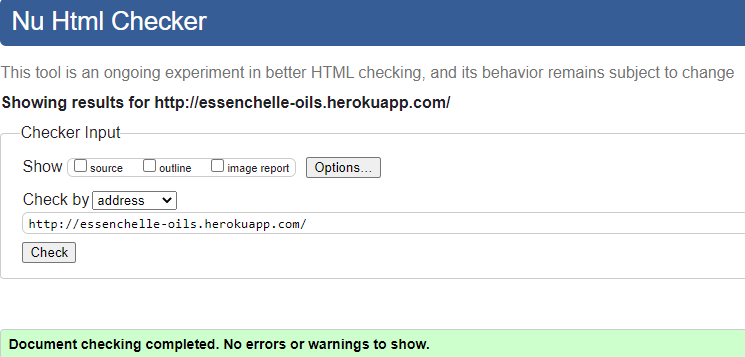
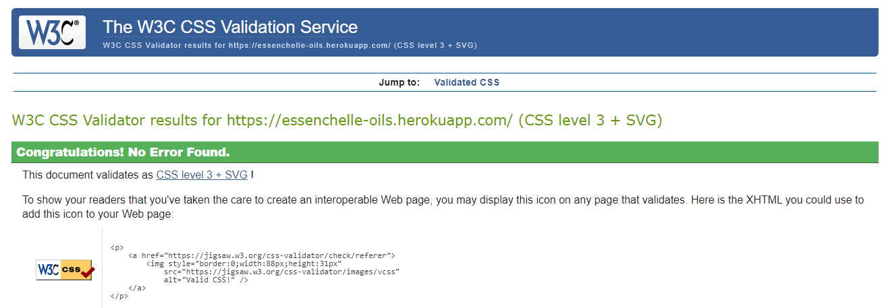
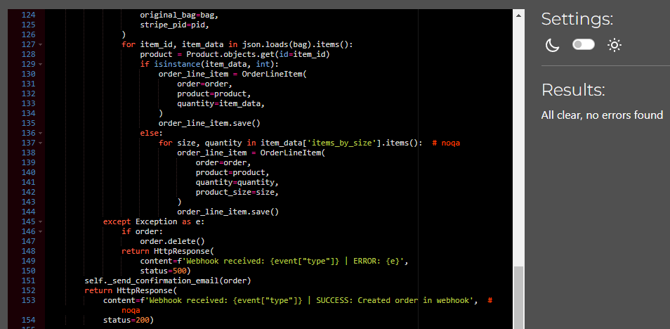
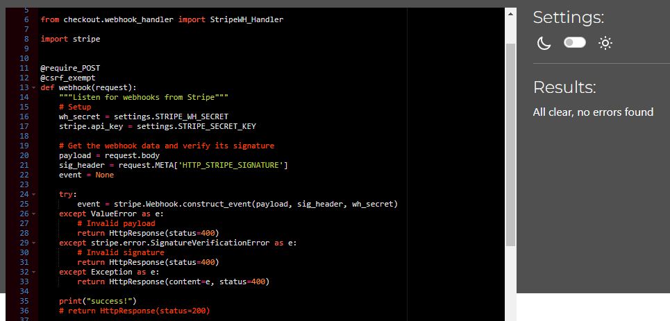
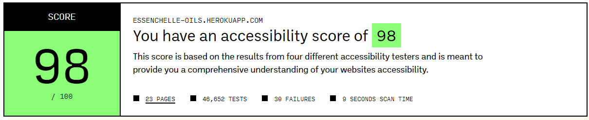
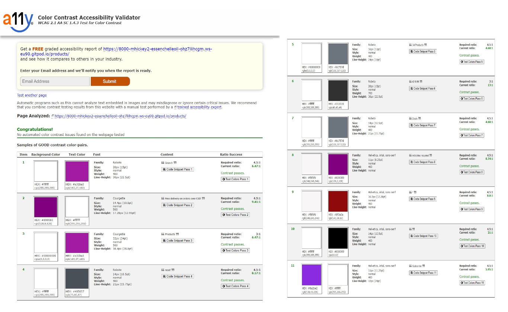

# EssenChelle Oil: Testing

Back to the [README](README.md)

Testing has taken place continuously throughout the development of the project. When faults were detected they were fixed on an ongoing basis. These were fixed locally in GitPod and committed to GitHub regularly. Faults fixed and outstanding can be found in the README.md Document.

# Table of Contents 

1. [Cross Browser Testing](#browsertesting)
2. [Responsive Testing](#responsivetesting)
3. [Validator Testing](#validatortesting)
     1. [W3C Validator](#w3c)
     2. [CSS Validator](#css)
     3. [Python](#python)
     4. [Lighthouse](#lighthouse)
     5. [Accessabilty](#accessability)
     6. [Contrast Checker](#contrastchecker)    
     7. [Link Checker](#linkchecker)
4. [Manual Testing](#manual)
5. [User Story Testing](#userstorytesting)  

#### [Return to README.md](README.md)
----

## Cross Browser Testing

  The site was tested in Google Chrome, Microsoft Edge and Mozilla Firefox on the Desktop. The site was also tested on a Lenovo Laptop, and a Xiomai Redmie Note 11. 

 

#### [Return to Table of Contents](#toc)

----
## Responsive Testing

   I regularly tested the responsiveness of the site using Google Chrome Developer tools, information on this can be found [here](https://developer.chrome.com/docs/devtools/). I did have issues with this tool near the end of the project for some reason if I used it I would lose internet (not sure why it was doing that) but had to find another alternative for testing, so I found [Responsive Test Tool Site](https://responsivetesttool.com/), which allowed me to test the site in a range of different devices. My site works well up to 5120 x 2880 screen size. I have set the max size of screen at 1500px. I also used Window Resizer and a Responsive Design Tester Application available in the Google Chrome Store. I also used the Am I responsive site to test the site and the image below is from that Testing:

    

   
      
         
   

     

#### [Return to Table of Contents](#toc)

----
## Validator Testing

1. W3C Validator 

Using [https://validator.w3.org/](https://validator.w3.org/) All Pages were tested with the validator, the results of the HTML validation can be seen below:

 

      
        

   
  
2. Jigsaw CSS Validator   
 
Using [https://jigsaw.w3.org/css-validator/](https://jigsaw.w3.org/css-validator/) 
The result can be seen below:

 

      
        

 

3. Python Validation   
  Python testing was done without the use of Pep8 as the site was down, instead an extension was added which highlighted errors and showed them in the problems panel within gitpod. Most errors during the build related to long lines, which I rectified. I also used [Code Institute Python Linter](https://pep8ci.herokuapp.com/). I found no faults from the gitpod linter testing and have included sample results from the Code Institute Linter

   

  
      
        
  

  
   

   
      
        
  

  
   

4. Lighthouse Testing   
I have been experiencing issues with Lighouse testing, although I have been working in incognitor there are still issues with getting accurate results (had same issues with previous projects). On many occassions it does not work at all and if it does work it encounters issues, I have removed extensions from incognito and tested other sites to esatablish a baseline, but tends to act the same way no matter what website I test, so I looked to alternatives that may work better, I have provided a sample score from Lighthouse and have used Page Speed Insights which I have had no problems with using and have provided scores to supplement the Lighthouse scores. There were errors in rendering third party code mainly bootstrap, JQuery,Stripe and MailChimp, but cannot really adjust or remove these as they are essential for functionality within the site. I will refer to this in the unsolved bugs in the readme.

 

      
         

  

      
         

  

      
         

  

5. Accessability Testing   
Used this tool, [Accesibility Test](https://accessibilitytest.org/) which carries out a range of tests on the site and the score can be seen below:

      
         

  

6. Contrast Checker  
  
Used [https://color.a11y.com/](https://color.a11y.com/) to check for any contrast issues. I did detect an issue with an asterisk but just gave it a class of text-danger and changed colour to darker version by using !important and this seemed to resolve the issue.  See images Below for evidence of good contrast on the site.

 
  
      
        
  

  
   

8. Link Checker   
Besides manually checking links on the site I used this tool as an extra measure for testing and the result can be seen below:

 

  
      
        
  

  
   

 #### [Return to Table of Contents](#toc)
----  

 

### 4. Manual Testing   

 

I have broken the manual testing into 2 sections, the first gives an overview of how the site works and whether it does what is expected. In the second section I have more specific testing of different elements within each page and the subsequent results.    

 

<h3 align ="center">      
    Manual Testing (Overview of how the Site works in general)   
</h3>

 

### On the Site:
- Start Screen displays when Heroku link is used.   :heavy_check_mark:
- The searchbar shows the results in products when search criteria is entered and selected.  :heavy_check_mark:
- The Account Link displays correctly for a user that is not logged in, it show Register and Login.  :heavy_check_mark:
- The Register link opens up the sign up form and allows a User to register for the site.  :heavy_check_mark:
- The Login Link opens up the login form and allows the User to login into the site.  :heavy_check_mark:
- The Account Icon displays a new set of options in the dropdown menu when the user is logged in and it is selected. :heavy_check_mark:
- The Product Management dropdown item takes you to the add product page.  :heavy_check_mark:
- The My Profile dropdown item takes you to the profile page.   :heavy_check_mark:
- The Product Favourites dropdown item takes you to the product favourites page.  :heavy_check_mark:
- The Logout link displays when the user has logged in.  :heavy_check_mark:
- The Logout dropdown item takes you to the Log out page.  :heavy_check_mark:
- The Logout link opens up the logout form and allows the User to logout of the site.  :heavy_check_mark:
- The Shopping Icon takes you to the Shopping Bag Page.  :heavy_check_mark:
- The all products link in the navbar shows the dropdown menu with the different options available  :heavy_check_mark:
- The by price options shows all products in order of price.  :heavy_check_mark:
- The by price options shows all products in order of rating.  :heavy_check_mark:
- The by price options shows all products in order of category.  :heavy_check_mark:
- The all products options shows all products.  :heavy_check_mark:
- The EssenChelle Products link in the navbar shows the dropdown menu with the different options available.
- The Essential Oils option shows all products in the Essential range.  :heavy_check_mark:
- The Massage Oils option shows all products in the Massage range.  :heavy_check_mark:
- The Oil Burner option shows all products in the Oil Burner range.  :heavy_check_mark:
- The all products options shows all products in the EssenChelle range.  :heavy_check_mark:  
- The Our Story link in the navbar shows the dropdown menu with the different options available.  :heavy_check_mark:
- The About us option takes you to the about us page.  :heavy_check_mark:
- The Our Products option takes you to the our products page.  :heavy_check_mark:
- The Blog option takes you to the blog page.  :heavy_check_mark:
- The Special Offers link in the navbar shows the dropdown menu with the different options available.
- The New Arrivals option shows the new arrival products.  :heavy_check_mark:
- The Deals option shows the new deals in products.  :heavy_check_mark:
- The Clearance option shows all the clearance products.  :heavy_check_mark:
- The all products options shows all products in Special Offers.  :heavy_check_mark: 
- The Contact link in the navbar shows the dropdown menu with the contact form option available.  :heavy_check_mark:
- The contact form opens up the contact page with the contact form for messaging.  :heavy_check_mark:
- The Shop Button opens up the all products page successfully.  :heavy_check_mark:
- The Privacy policy link will open the privacy policy page.  :heavy_check_mark:
- The Faq link in the footer and within the Our Story dropdown menu will open the FAQ page.  :heavy_check_mark:
- THe Copyright link will open the copyright page.  :heavy_check_mark:
- The Facebook Icon when clicked takes you to a generic facebook page.  :heavy_check_mark:
- The Twitter Icon when clicked takes you to a generic twitter page.  :heavy_check_mark:
- The Instagram Icon when clicked takes you to a generic Instagram page.  :heavy_check_mark:
- The Newsletter Mailchimp Form takes an email input and submits email to Mailchimp. :heavy_check_mark:
- All required fields need to be filled in when posting a new product, and the user is advised on these requirements when filling these forms.  :heavy_check_mark:
- The add product button displays correctly for the Superuser.  :heavy_check_mark:
- The superuser can see the edit and delete buttons for any all existing products  :heavy_check_mark:
- The edit product page displays correctly for the Superuser.  :heavy_check_mark:
- The superuser can edit the details of the product with the edit form.  :heavy_check_mark:
- The delete product page displays correctly for the Superuser.  :heavy_check_mark:
- the superuser can delete a product with the delete product form.  :heavy_check_mark:
- Clicking on the product image for each product will bring the user to the product-detail page for each product.  :heavy_check_mark:
- The product_detail page displays correctly.  :heavy_check_mark:
- All required fields need to be filled in when posting a new blog, and the user is advised on these requirements when filling these forms.  :heavy_check_mark:
- The add blog button displays correctly for the Superuser.  :heavy_check_mark:
- The superuser can see the edit and delete buttons for any all existing blogs  :heavy_check_mark:
- Clicking on the read more button for each blog will bring the user to the blog-detail page for each blog.  :heavy_check_mark:
- The blog_detail page displays correctly.  :heavy_check_mark:
- The add to favourites button adds the product to the user's product favourites.  :heavy_check_mark:
- On the product favourites page clicking on the removal button will remove item from favourites. :heavy_check_mark: 
- The add to bag button adds an item to the users bag. :heavy_check_mark:
- the quanity and sizes selector allows you to select the desired quantity or size.  :heavy_check_mark:
- The return to shopping button allows you to continue shopping for items.  :heavy_check_mark:
- The Checkout form displays when you click on the go to the secure checkout button.  :heavy_check_mark:
### Admin Panel:
- Managed to create, update and delete data in all models, during the entire project, and all seems to be working as expected when logged in as the admin.  :heavy_check_mark:
- When a User comments on a post, Admin needs to approve before it is displayed on the site, this is working as expected, when logged in as the admin.  :heavy_check_mark:

 

  
Manual Testing(part 2)

 

### Navigation Links on Base Page (on all pages)

 

| Feature            |  Expect                       | Action   | Result    |
| ------------------ | ----------------------------- | -------- | ----------|
|  Logo              | Navigation Link               | Click On |   ✔       | 
|  Home              | Navigation Link               | Click On |   ✔       |
|  Search Bar        | Navigation Link               | Click On |   ✔       |
|  If Results        | Results are Displayed         | Click On |   ✔       |
|  If no Results     | Message Shown to Advise       | Click On |   ✔       |
|  My Account Icon   | Dropdown Menu                 | Click On |   ✔       |
|  Register          | Navigation Link               | Click On |   ✔       |
|  Log In            | Navigation Link               | Click On |   ✔       |
|  My Profile        | Navigation Link               | Click On |   ✔       |
|  Product Favourites| Navigation Link               | Click On |   ✔       |
|  Log out           | Navigation Link               | Click On |   ✔       |
|  Shopping Bag Icon | Navigation Link               | Click On |   ✔       |
|  Home              | Navigation Link               | Click On |   ✔       |
|  All Products      | Dropdown Menu Link            | Click On |   ✔       |
|  By Price          | Navigation Link               | Click On |   ✔       |
|  By Rating         | Navigation Link               | Click On |   ✔       |
|  By Category       | Navigation Link               | Click On |   ✔       |
|  All Products      | Navigation Link               | Click On |   ✔       |
|Essenchelle Products| Dropdown Menu Link            | Click On |   ✔       |
|  Essential Oils    | Navigation Link               | Click On |   ✔       |
|  Massage Oils      | Navigation Link               | Click On |   ✔       |
|  Oil Burners       | Navigation Link               | Click On |   ✔       |
|  All Products      | Navigation Link               | Click On |   ✔       |
|  Our Story         | Dropdown Menu Link            | Click On |   ✔       |
|  About Us          | Navigation Link               | Click On |   ✔       |
|  Our Products      | Navigation Link               | Click On |   ✔       |
|  Blog              | Navigation Link               | Click On |   ✔       |
|  Special Offers    | Dropdown Menu Link            | Click On |   ✔       |
|  New Arrivals      | Navigation Link               | Click On |   ✔       |
|  Deals             | Navigation Link               | Click On |   ✔       |
|  Clearance         | Navigation Link               | Click On |   ✔       |
|  All Specials      | Navigation Link               | Click On |   ✔       |
|  Contact           | Dropdown Menu Link            | Click On |   ✔       |
|  Contact Form      | Navigation Link               | Click On |   ✔       |

 

### Footer  (on all Pages)

| Feature               |  Expect                                   | Action   | Result    |
| ------------------    | ----------------------------------------- | -------- | ----------|
| Icon Facebook         | Social Media Link - goes to external site | Click On |   ✔       |
| Icon Twitter          | Social Media Link - goes to external site | Click On |   ✔       | 
| Icon Instagram        | Social Media Link - goes to externalsite  | Click On |   ✔       |
| Newsletter Submission | Newsletter Form - Email address input and | Input    |   ✔       |
|                       | submission button works - Email Saved     | Click On |   ✔       |

 

### Home Page

| Feature             |  Expect                                   | Action   | Result  |
| ------------------  | ----------------------------------------- | -------- | --------|
| Shop Now Button     | Button takes the user to the Products Page| Click On |  ✔      |

 

### Products Page
products page can be displayed in a number of different formats, tested the page according to the different display criteria:

| Feature                |  Expect                                   | Action   | Result    |
| ------------------     | ----------------------------------------- | -------- | ----------|
| Sorting by price       | Products are arranged by price            | Click On |    ✔      | 
| Sorting by rating      | Products are arranged by rating           | Click On |    ✔      |
| Sorting by category    | Products are arranged by category         | Click On |    ✔      |
| sorting feature on page| Sorts correctly by criteria selected      | Click On |    ✔      |
| Zoom Effect on Products| Zoom Effect                               | Hover    |    ✔      |
| Product image link     | Opens the product detail Page             | Click On |    ✔      |
| Add a Product Button   | Opens the add a Product Page              | Click On |    ✔      |
| Edit a Product Link    | Opens the edit a Product Page             | Click On |    ✔      |
| Delete a Product Link  | Opens the delete a Product Page           | Click On |    ✔      | 
| Product amount         | Shows correct number for Product ammount  | Click On |    ✔      |

All products were displayed the same way, regardless of the category type so the EssenChelle Products and Special Offers sections displayed the products, the same way as the main products page, so all the individual elements are working properly.

 

### Product Detail Page

| Feature                 |  Expect                         | Action       | Result    |
| --------------------    | --------------------------      | --------     | ----------|
| Product is featured     | Displays Correctly              | Automatic    |    ✔      |
| Add to Favourites       | Adds Product to User favourites | Click On     |    ✔      |
| Quantity Selector       | Can add or delete quantitiy     | Click On     |    ✔      |
| Add to Bag Button       | Adds Product to Shopping Bag    | Click On     |    ✔      |
| Pop Up                  | Displays information of Purchase| Click On     |    ✔      |
| Keep Shopping Button    | Allows user to Keep Shoppig     | Click On     |    ✔      |
| Edit Button shows       | Displays if User is superuser   | Automatic    |    ✔      |
| Edit Button             | Opens the Edit_Product Page     | Click On     |    ✔      |
| Delete Button shows     | Displays if User is superuser   | Automatic    |    ✔      |
| Delete Button           | Opens the Delete_Product Page   | Click On     |    ✔      |
| Review & No             | Show number of Reviews          | Automatic    |    ✔      |
| Reviews are displayed   | Displays Correctly              | Automatic    |    ✔      |
| Review Form shown       | Displays Correctly              | If logged in |    ✔      |
| Submit Review Button    | Submits a review                | If logged in |    ✔      |
| Back Button             | Go to Home Page                 | Click On     |    ✔      |     

 

### Add A Product Form Page (Product Management Page)

| Feature             |  Expect                     | Action    | Result|
| --------------------| --------------------------  | --------  | ------|
| Category Field      | Shows Categories            | Click On  |   ✔   |
| Input Fields        | Accepts input               | Input     |   ✔   |
| Image Upload        | Uploads Image               | Click On  |   ✔   |
| Add Product Button  | Adds Product                | Click On  |   ✔   |
| Back Button         | Go to Home Page             | Click On  |   ✔   | 

 

### Edit A Product Form Page

| Feature              |  Expect                     | Action    | Result|
| -------------------- | --------------------------  | --------  | ------| 
| Category Field       | Shows Category              | Automatic |   ✔   |
| Text Fields          | Shows Details of Product    | Input     |   ✔   |
| Image Displays       | If image already uploaded   | Automatic |   ✔   |
| Image Upload         | Uploads Image               | Click On  |   ✔   |
| Update Product Button| Edits Product               | Click On  |   ✔   |
| Back Button          | Go to Home Page             | Click On  |   ✔   | 

 

### Delete a Product Form Page

| Feature             |  Expect              | Action    | Result|
| --------------------| -------------------- | --------  | ------| 
| Product Name        | Displayed to User    | Automatic |   ✔   |
| Delete Button       | Deletes the Blog     | Click On  |   ✔   |
| Back Button         | Go to Home Page      | Click On  |   ✔   | 

 

### About us Page

| Feature                     |  Expect                      | Action      | Result  |
| --------------------        | --------------------------   | --------    | ------  | 
| Products Carousel indicators| Carousel changes images      | Click On    |   ✔     |
| Back Button                 | Go to Home Page              | Click On    |   ✔     | 

 

### Our Products Page

| Feature                     |  Expect                      | Action      | Result  |
| --------------------        | --------------------------   | --------    | ------  | 
| Zoom Effect      | Zoom effect on Products & Testimonials  | Click On    |   ✔     |
| Back Button      | Go to Home Page                         | Click On    |   ✔     | 

 

### Blog Page

| Feature             |  Expect                            | Action       | Result |
| --------------------| --------------------------         | --------     | ------ |
| Blogs               | Displays Correctly                 | Automatic    |    ✔   |            
| Add a Post Button   | Opens add Post Form if superuser   | Click On     |    ✔   |     
| Edit Post Button    | Opens Edit Post Form if superuser  | Click On     |    ✔   |
| Delete Post Button  | Opens Delete Post Form if superuser| Click On     |    ✔   |
| Comment & No        | Show number of Comments            | Automatic    |    ✔   |
| Top Button          | Go to Top of Screen                | Click On     |    ✔   |
| Zoom Effect on Blogs| Zoom Effect                        | Hover        |    ✔   |
| Read More Button    | Go to Post_Detail Page             | Click On     |    ✔   |
| Learn More Button   | Takes user to Site with more info  | Click On     |    ✔   |

 

### Blog Details Page

| Feature                 |  Expect                    | Action       | Result    |
| --------------------    | -------------------------- | --------     | ----------|
| Blog is featured        | Displays Correctly         | Automatic    |    ✔      |
| Comment & No            | Show number of Comments    | Automatic    |    ✔      |
| Comments are displayed  | Displays Correctly         | Automatic    |    ✔      |
| Comment Form shown      | Displays Correctly         | If logged in |    ✔      |
| Submit Comment Button   | Submit a comment           | If logged in |    ✔      |
| Back Button             | Go to Home Page            | Click On     |    ✔      |     

 

### Add A Blog Form Page

| Feature             |  Expect                     | Action    | Result|
| --------------------| --------------------------  | --------  | ------|
| Input Fields        | Accepts input               | Input     |   ✔   |
| Image Upload        | Uploads Image               | Click On  |   ✔   |
| Status Field        | Shows Options               | Click On  |   ✔   |
| Add Blog Button     | Adds new Blog               | Click On  |   ✔   |
| Summernote Editor   | Toolbar Works               | Click On  |   ✔   |
| Back Button         | Go to Home Page             | Click On  |   ✔   | 

 

### Edit A Blog Form Page

| Feature             |  Expect                     | Action    | Result|
| --------------------| --------------------------  | --------  | ------| 
| Input Fields        | Accepts input               | Input     |   ✔   |
| Image Displays      | Displays image if uploaded  | Automatic |   ✔   |
| Image Upload        | Uploads Image               | Click On  |   ✔   |
| Status Field        | Shows Options               | Click On  |   ✔   |
| Summernote Editor   | Toolbar Works               | Click On  |   ✔   |
| Update Button       | Edis the Blog               | Click On  |   ✔   |
| Back Button         | Go to Home Page             | Click On  |   ✔   | 

 

### Delete a Blog Form Page

| Feature             |  Expect              | Action    | Result|
| --------------------| -------------------- | --------  | ------| 
| Blog Name           | Displayed to User    | Automatic |   ✔   |
| Delete Button       | Deletes the Blog     | Click On  |   ✔   |
| Back Button         | Go to Home Page      | Click On  |   ✔   | 

 

### Contact Page

| Feature             |  Expect              | Action    | Result|
| --------------------| -------------------- | --------  | ------| 
| Google Map          | Displayed to User    | Automatic |   ✔   |
| Contact Form        | Displayed to User    | Automatic |   ✔   |
| Input Fields        | Accepts Input        | Input     |   ✔   |
| Submit Button       | Submits Message      | Click On  |   ✔   |
| Back Button         | Go to Home Page      | Click On  |   ✔   | 

 

### My Profile Page

| Feature                   |  Expect              | Action    | Result|
| --------------------      | -------------------- | --------  | ------| 
| Delivery Information Form | Displayed to User    | Automatic |   ✔   |
| Input Fields              | Accepts Input        | Input     |   ✔   |
| Update Information Button | Deletes the Blog     | Click On  |   ✔   |
| Order History             | Displayed to User    | Automatic |   ✔   |
| Back Button               | Go to Home Page      | Click On  |   ✔   | 

 

### Product Favourites Page

All products were displayed the same way as the main products page, so all the 
individual elements are working properly.

| Feature       |  Expect                          | Action    | Result|
| --------------| ----------------------------     |  ------   | ------| 
| Remove Button | Removes Product from Favourites  | Click On  |   ✔   |
| Back Button   | Go to ? Page                     | Click On  |   ✔   | 

 

### Shopping Bag Page

| Feature                   |  Expect                          | Action    | Result|
| --------------------      | -------------------------------  | --------- |-------| 
| Remove Button             | Removes Product from Favourites  | Click On  |   ✔   |
| Product Information       | Displays to User                 | Automatic |   ✔   |
| Quantity Selector         | Can add or delete quantitiy      | Click On  |   ✔   |
| Displays GrandTotal       | Displays to User                 | Automatic |   ✔   |
| Keep Shopping Button      | Allows user to Keep Shoppig      | Click On  |   ✔   |
| Add to Bag Button         | Adds Product to Shopping Bag     | Click On  |   ✔   |
| Back Button               | Go to ? Page                     | Click On  |   ✔   | 

 

### The Checkout Page

| Feature                   |  Expect                   | Action    | Result|
| --------------------      | --------------------      | --------  | ------| 
| Input Fields              | Accepts Input             | Input     |   ✔   |
| Adjust Bag Button         | Brings you to Bag Page    | Click On  |   ✔   |
| Complete Order Button     | Order to be processed     | Click On  |   ✔   |
| Displays Order Summary    | Displays to User          | Automatic |   ✔   |
| Spinner                   | Displays during processing| Automatic |   ✔   |

 

### The Checkout Success Page

| Feature                   |  Expect                   | Action    | Result|
| --------------------      | --------------------      | --------  | ------|
| Order Information         | Displays to User          | Automatic |   ✔   |
| Order Details             | Displays to User          | Automatic |   ✔   |
| Delivery Address          | Displays to User          | Automatic |   ✔   | 
| Billing Information       | Displays to User          | Automatic |   ✔   |
| Latest Deal Buttons       | Takes you to latest Deals | Click On  |   ✔   |

 

### Sign Up Page

| Feature             |  Expect                        | Action    | Result    |
| --------------------| ----------------------------   | --------- | ----------|
|  Input Fields       | Accept input                   |  Input    |   ✔       |
|  Sign Up Button     | Register for Site              | Click On  |   ✔       |
|  Link to Login      | Go to Login Page               | Click On  |   ✔       |
| Profile for Site    | User gets Profile if registered| Automatic |   ✔       |

 

### Login Page

| Feature             |  Expect                      | Action    | Result    |
| --------------------| ---------------------------- | --------- | ----------|
|  Input Fields       | Accept Input                 |  Input    |   ✔       |
|  Log In Button      | Log in to Site               | Click On  |   ✔       |
|  Sign Up Link       | Go to SignUp Page            | Click On  |   ✔       |

 

### Sign Out Page

| Feature             |  Expect                          | Action    | Result    |
| --------------------| ----------------------------     | --------- | ----------|
|  Sign Out Button    | Sign Out and return to home page | Click On  |   ✔       |

 

 

### [Return to Table of Contents](#toc)
----

 

### 5. User Story Testing

  

**As a Website User I can....**

**1. Log in and access more features on the site.**
- User Account Login/Logout - As a User, I would like to be able to login or logout of my account, so that I can avail of the sites full functionality.
- Receive Welcome Emails - As a user I would like to receive a welcome email after registering for the site.
- When a User registers on the site, they have access to full functionality within the site. They can add a review for a product or comment on a blog in the blog section. They can see also see their product favourites.

**Testing:**
- Log in Button allows user to log in to the site.
- User is able to see nav items available for the logged in user.
- Log out Button allows user to log out of the site.
- Email is sent to a newly registered user.
    
All Tests Passed &#x2611;

**2. Find the purpose of the site easily by reviewing the content.**
- The Navbar is available on each page of the website, it contains links referring to the type of products available on the site. 
- There is introductory text on the home page, which clearly indicates the theme of the site, and the type of content that will be available within the site. 
- The title of the Site also gives an indication of the type of products that are being sold in the site.

**Testing:**
- The title, content and nav links reflect the theme of the site

This is subjective in nature, but I do believe this has been achieved though.

Test Passed &#x2611;

**3. View a collection of Products that are available for sale.**
- The Products for sale are displayed clearly on the product pages.

**Testing**
- The Products are showing correctly in the various product pages and they can be displayed using a host of different sorting criteria. (see future user story) 

Test Passed &#x2611;

**4. Select an individual item to see the full details for the product.** 
- When I click on any of the products I am taken to a products detail page where I can see all related information for the product.

**Testing**
- Clicked on the Product images of several produts in the product pages and was redirected to the product detail pages for each of the products.

Tests Passed &#x2611;

**5. View products according to their category type.**
- Products can be displayed according to their category, the main categories in the EssenChelle range are essential, massage and oil burners, and within the special offers, they are broken down to arrivals deals and clearance items.
- The all products nav dropdown menu has a link to arrange the products according to their category type.

**Testing**
- Tested by choosing different link items in both the essenchelle range dropdown menu and the special offer dropdown menu to ensure all items within a category are displaying correctly.
- Tested by choosing selectors at the top of the screen to show the individual categorty types.
- Within the allproducts dropdown menu you can choose the link to sort by category and the productss are displayed within their own categories in consecutive order.

Tests Passed &#x2611;

**6. Easily be able to identify the cheapest or most highly rated products.**
- Products can be arranged according to the lowest or highest prices. This can be done for all products or within each product category by means of the sorting selector to the right top of the products page.

**Testing**
Did a range of testing by selecting the desired sorting criteria and evaluating whether the products have been arranged by the selected criteria, these tests showed the correct responses.

Tests Passed &#x2611;

**7. Sort products against a number of sorting critera.**
- Products can also be arranged by their rating. This can be done for all products or within each product category by means of the sorting selector to the right top of the products page.

**Testing**
Did a range of testing by selecting the desired sorting criteria and evaluating whether the products have been arranged by the selected criteria, these tests showed the correct responses.

Tests Passed &#x2611;

**8. Informed about the progress of my actions and interactions within the site.**
- Throughout different processes on the site, the user will be informed by toast messaging when they are interacting with the site.
- Implement Django messages and trigger them for user activity.

**Testing**
Throughout user interaction in the site, messages are displayed to the user, and will remain until the user closes them. Examples would include when signing in to the site, when submitting a comment or a review, when selecting a favourite, when adding an item to the bag and when the user has successfully placed an order on the site. All messages were displayed in result to the user's actions.

Tests Passed &#x2611;

**9. Be able to attain and view my profile within in the site.**
- When the user sign in they will be able to access their profile page within the account icon dropdown menu.

**Testing**
When the user signs in they can see their 'my profile' page within the account dropdown menu. This is not visible before they have logged in. Tested logging in and reviewing this page, it opens and you can see the default delivery information and a history for all previous orders within the site.

Tests Passed &#x2611;

**10. Receive an email when I register for the site.**
- When a new User registers for the site, they will be sent an email to confirm their registration.

**Testing**
Tested this feature by registering for the site, while during development the welcome email was displayed in the terminal, but on the deployed site I used the temp email site to generate a temporary email and used this when registering, I then monitored that site to check that the email was sent successfully.

Tests Passed &#x2611;

**11.  Will be able to contact the site owner with the contact form.**
- There is a contact form within the Contact Nav dropdown menu, where the user can send a message to the Company. This may be to enquire about products or with queries on deliveries or suggestions for further products for the site. The email will have fields for their name, their email, the subject details and the message itself.

**Testing**
I tested the form by inputting details, the form took the input correctly and the submit button submitted the message. While working in development mode, the message details were shown in the terminal window and can be seen within the admin panel.

Tests Passed &#x2611;

**12.   View a collection of Blogs in the blog Section.**
- A User can view a selection of blogs that have a spotlight on the products within the site.

**Testing**
The Blogs are showing correctly in the blog section, the user can see the title, an excerpt and and image for each blog. In the sidebar there is also a list of the most recent blogs, so the user can see the titles for the most recent blogs in chronological order.

Tests Passed &#x2611;

**13.  User can select a blog and see the full details for that individual blog.**
- When a User choses a blog they will be taken to the blog detail page where they can see the full content for the specific blog.
  
**Testing**
Tested by selecting an image in a product in the product page and it successfully sent you to the product detail page, with a full description of the product showing.

Tests Passed &#x2611;

 

**As a logged in User I can…...** 

**1. Select products and these will be included in my shopping bag.**
- When shopping on the site, you can add different products to your shopping bag. 
- When you select a product you are redirected to the product detail page where you have the option to add the item
- When you select the item, you can choose the quantity and if different sizes available you can choose the size required.
- When you add the item to the bag you will be presented with a success message showing you the details of your purchase, the quantity and the cost excluding delivery.
  
**Testing**
I tested this process by following the above steps, and I added a number of items in different quantities and in different sizes where available. The message displayed showed all the details for the products I had selected to purchase. Everything worked as it was supposed too.

Tests Passed &#x2611;

**2. View the Total of my purchases on the site.**
- As you shop on the site you can see the amount of your puchases under the shopping bag icon at the top of the screen, you will also be presented with a popup with the details of your purchase and a running total of your purchases.

**Testing**
The shopping bag icon shows a 0 total before any purchases are made, but as you add items to your bag, the price will change to reflect your purchases. There is a delivery charge included if your purchases are under 50 and if over 50 the delivery charge is not applied.

Tests Passed &#x2611;

**3. Select products in different sizes where available.**
- When shopping on the site, if products have the option of different sizes available you can choose the size required.

**Testing**
There are only a few items that have different sizes, but where this is possible the size selector shows the different sizes available. currently both sizes have the same prices but in future iterations I would hope to include different prices for different size items. As items would probably have different prices for different sizes, this would be a bug in the system, which will be included in the unsolved bug section in the readme.

**4. Choose to remove or adjust the items in my shopping bag.**
- As you go through the shopping process you can adjust your bag by adding more items, removing items or change the quantity of items being purchased.

**Testing**
Tested this by adding and removing items from the shopping bag and checking to see the purchase details show the changes that have been made.

Tests Passed &#x2611;

**5. Checkout the products in my shopping bag.**
- When you have completed purchasing your items, you can access the checkout page by clicking on the secure checkout button, you will be taken to the checkout page where you can complete your form with all the details required to ensure your purchase is successfully completed.

**Testing**
For testing, I completed the sequence above, when I opened the checkout page, I added my Billing and Delivery details and added my credit card details, and when the purchase process is completed I am shown the success page and am shown a message telling me my purchase was successful. While in development and my webhook is successful, my confirmation email is shown in my terminal, but in the deployed site a confirmation email is sent to my email address.

Tests Passed &#x2611;

**6. Make a secure payment for my purchases.**
- Within the secure checkout page form you can add your credit/debit card details.
- User will be informed if there is any validation error in regards to their card information.
- User will be told how much their card will be charged for their purchases.
- Implemented Stripe payment functionality for inputting and processing card payments.

**Testing**
I tested the purchasing process by adding products to the shopping bag and choosing the secure checkout option, when I was directed to this page, I filled in my details, I tried adding the wrong details in the card detail section, and was advised I had made an error, when I correctly added the correct details, the spinner showed the shopping process was being processed and when completed I was redirected to the checkout success page. I also was advised that the process has been successful in a toast message. A confirmation email was also sent to the supplied email address.

Tests Passed &#x2611;

**7. Add a review for products on the site.**
- When the User is logged in they will have access to the review form on the product details page.  They can then submit a review, they will be informed that their review will need to be approved by admin before it will be published in the review section.

**Testing**
The review form is not visible when a user is not logged in.
When logged in a User can see and use the review form.
Tested this form, and the review is saved to the database and when approved by admin, the reviews is pubished in the review section.

Tests Passed &#x2611;

**8. Select my favourite products on the site and save them to my product favourites.**
- The logged in user will be able to add products to favourites and will be able to see all products that have been saved as favourites in the favourites page, which can be found within the account icon dropdown at the top of the page.
- The logged in user can remove items from favourites by using the remove button from below each product, within the favourite products page.

**Testing**
Tested to see if you could add product to favourites if not logged in, and you are redirected to the login page. When logged in the user can add product to favourites and you can access the product favourites page. Tested to see if the remove button works and this removed the relevant item from the favourites page.

Tests Passed &#x2611;

**9. Leave a comment for a blog in the blog section.**
- When a User is logged in they will have access to the comment form in the blog details page. They can then submit a comment, they will be informed that their comment will need to be approved by admin before it will be published in the comment section.

**Testing**
The comment form is not visible when a user is not logged in.
When logged in a User can see and use the comment form.
Tested this form, and the comment is saved to the database and when approved by admin, the comment is pubished in the comment section.

Tests Passed &#x2611;

**10. Sign up for a newsletter so I can receive special offers and the latest product information.**
- The newsletter form can be found in the footer section on all pages. This form has been sourced from mailchimp and all the logic and main styling has been imported from mailchimp. When the User enters their email and submits the form, their email will be saved to the mailing list using mailchimp. 
- The newsletter is a fictional feature and is just for educational purposes.

**Testing**
Tested by entering an email and submitting the details, and the email submitted has been successfully added to the mailing list.

Tests Passed &#x2611;
 
  
 

**As a Superuser/Admin I want to...**

**1. Add Products to the Database.**
- Add a product without needing to access the Admin page. This can be accessed by using the product management link within the account icon at the top of the screen. As a superuser you can also access this feature by using the add product button on the bottom left of the products page. This button takes the superuser to the add product form page where they can add details for the new product.

**Testing**
As an ordinary user, you can not access this page, If you try to access this page as a user who is not logged in you will be redirected to the login page. If you are logged in but not a superuser you will be shown a message telling you only shopowner can add a product. The page itself can be reached by using either the add product button and the product management button. The form itself will take input and allow you to upload an image. If no image is uploaded, a generic image will be applied to the product. A message is shown to the user to let them know they have added the product, and the product will be displayed within the category that was included. I tested all these stages of the process and they worked as expected.

Tests Passed &#x2611;

**2. Edit Products in the Database.**
 Edit a product without needing to access the Admin page. This can be accessed by using the edit button link below the product in the products page and the product details page.  This button takes the superuser to the edit product form page where they can edit the details for an existing product.

**Testing**
As a superuser you can see the edit button below products on the product pages and within the product detail page below the product description. An ordinary user cannot see these options. If a unlogged user tries to access this option they will be redirected to the login page. If logged in but not a superuser, they will be shown an error message telling them that they can not edit the product. Followed all these routes and the application worked as expected.  Followed all these user routes and the application worked as expected.

Tests Passed &#x2611;

**3. Delete Products in the Database.**
Delete a product without needing to access the Admin page. This can be accessed by using the delete button link below the product in the products page and the product details page.  This button takes the superuser to the edit product form page where they can edit the details for an existing product.

**Testing**
As a superuser you can see the delete button below products on the product pages and within the product detail page below the product description. An ordinary user cannot see these options. If a unlogged user tries to access this option they will be redirected to the login page. If logged in but not a superuser, they will be shown an error message telling them that they can not delete the product. Followed all these user routes and the application worked as expected.  

Tests Passed &#x2611;

**4. Add Blogs to highlight products on the site.**
As a superuser you can access this feature by using the add blog button on the bottom left of the Blog page. This button takes the superuser to the add blog form page where they can add details for the new blog.

**Testing**
The form itself takes input and allows you to upload an image. If no image is uploaded, a generic image will be applied to the blog. A message is shown to the user to let them know they have added the blog, and the new blog will be displayed. I tested adding a blog as a supersuer and was successfully able to add a post. If I am not logged in I cannot access this functionality and if logged in and not a user am advised that you cannot do this. Tried to access as all types of user and it acted accordingly.

Tests Passed &#x2611;

**5. Edit Blogs on the site.**
As a superuser you can see the edit buttons below each blog in the blog page, you can also access by using the edit button on the blog detail page. You will be taken to the edit post page and you can amend an existing post, and the amended post will appear on the blog page.

**Testing**
As a superuser you can see the edit button below individual blogs on the blog page and within the product detail page below the blog content. An ordinary user cannot see these options.  If logged in but not a superuser, the user will be shown an error message telling them that they can not edit a blog. Followed all these routes and the application worked as expected.  

Tests Passed &#x2611;

**6. Delete Blogs on the site.**
As a superuser you can see the delete buttons below each blog in the blog page, you can also access by using the delete button on the blog detail page. You will be taken to the delete post page and you will be asked if you are sure you want to delete the stated post, if you do the post will be removed and it will no longer be displayed on the blog page.

**Testing**
As a superuser you can see the delete button below blogs on the blog pages and within the product detail page below the product description. An ordinary user cannot see these options. If logged in but not a superuser, they will be shown an error message telling them that they can not delete the product. Followed all these user routes and the application worked as expected.  

Tests Passed &#x2611;

**7. Approve reviews for Products and comments for Blogs in the admin Panel**
The Admin can do the full range of admin functionality within the admin panel. As a superuser you can log in to the admin panel and view a range of information on users, products, comments, reviews  and contacts. You can add Products and Blogs, review orders, change user details, approve comments for blogs and reviews for products, and and when they are approved they are published on the site.

**Testing**
- Managed to create, update and delete data in all models, during the entire project, and all seems to be working as expected when logged in as the superuser. 
- When a User comments on a post, Admin needs to approve before it is displayed on the site, this is working as expected, when logged in as the superuser. 
- When a User submits a review on a product, the superuser needs to approve it before it is displayed on the site, this is working as expected, when logged in as the superuser.

Tests Passed &#x2611;

